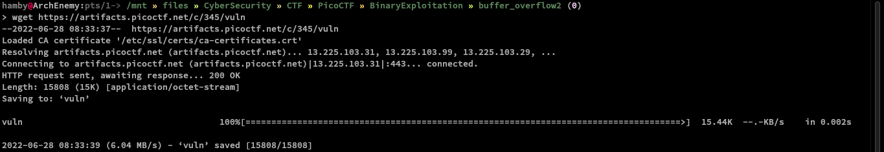
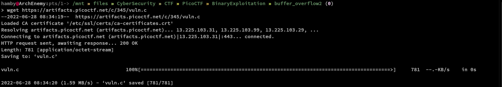
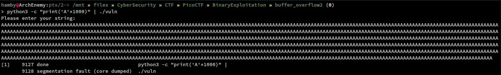
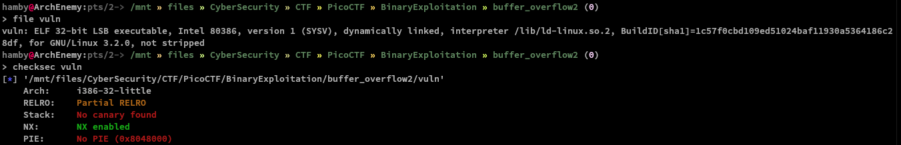
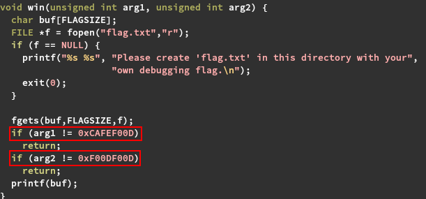
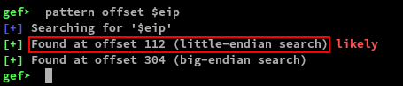
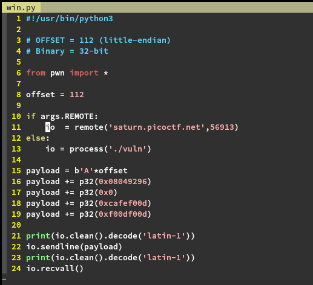
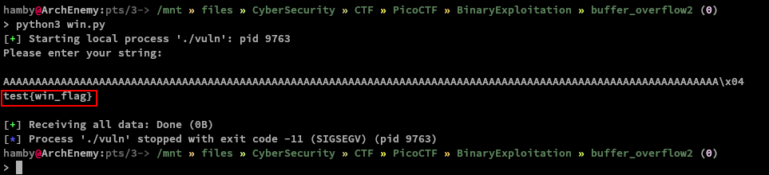
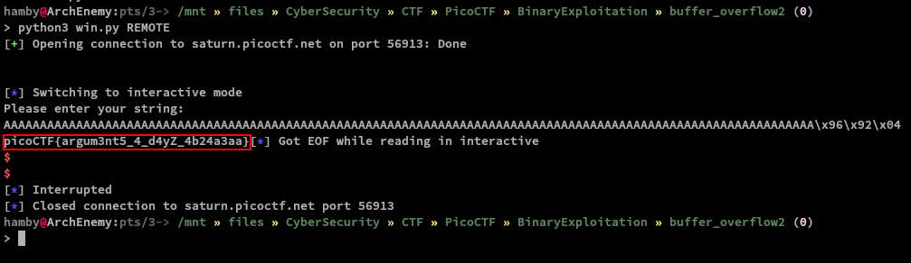

# PicoCTF 2022

```bash
Name: buffer_overflow2
Category: Binary Exploitation
Points: 
```

## Summary

- The program `vuln.c` is similar to the previous buffer overflow challenges but this time we need to pass the checks for `arg1` and `arg2` respectively as defined in `win()` function.
- The program uses `gets()` function which we all know that is dangerous since this function does not check the length that it will read and can overwrite the buffer.

## Code Snippet

### win() function

```C
// include libraries go up here...
#define BUFSIZE 100
#define FLAGSIZE 64

void win(unsigned int arg1, unsigned int arg2) {
  char buf[FLAGSIZE];
  FILE *f = fopen("flag.txt","r");
  if (f == NULL) {
    printf("%s %s", "Please create 'flag.txt' in this directory with your",
                    "own debugging flag.\n");
    exit(0);
  }

  fgets(buf,FLAGSIZE,f);
  if (arg1 != 0xCAFEF00D)
    return;
  if (arg2 != 0xF00DF00D)
    return;
  printf(buf);
}

```

### vuln() function

```C
void vuln(){
  char buf[BUFSIZE];
  gets(buf);
  puts(buf);
}

```

## Solution

1. First, we download the binary and source code using `wget` command. To do this, type in the terminal:

   - Command: `wget https://[URL GOES HERE]/vuln`

   

   - Command: `wget https://[URL GOES HERE]/vuln.c`

   

2. Let's test the binary and see if we can trigger a segmentation fault. Check [here](https://en.wikipedia.org/wiki/Segmentation_fault) to know more about segmentation faults.

   - Command: `python3 -c "print('A'*1000)" | ./vuln`

   

   - Explanation: We printed `1000` `A`'s and piped out the output to the input of `./vuln` process. Check [here](https://opensource.com/article/18/8/introduction-pipes-linux) for quick introduction for the pipe usage in Linux.

3. We can also check for the error message using `dmesg` to give us more insight about why our binary crashes when we send a lot of `A`'s.

   - Command: `sudo dmesg | grep segfault`

   

   - Explanation: Examine all messages from kernel ring buffer and find an error message with `segfault`.
   - Output explanation: We have overwritten the instruction pointer (`ip`) which causes segmentation fault.
   - Note: (*ip `0000000041414141`*) -> This `41414141` is our `A`'s that we sent using `python`. And according to [wiki](https://en.wikipedia.org/wiki/Segmentation_fault), segmentation fault is raised when we try to **access restricted parts of memory** or **write to a read-only location** or to **overwrite part of the operating system**.

4. We can also run `checksec` and `file` command to see what securities does the binary has.

   - Command: `file vuln` followed by `checksec vuln`.

   

   - Explanation: `file` command determines the file type and `checksec` identifies which security properties in a binary is set.

5. Looking at the source code, we must create a `flag.txt` file to work on this binary locally.

   - Command: `echo 'test_flag' > flag.txt`
   - Explanation: writes `test_flag` into `flag.txt` file.

6. We can also see that there are hardcoded arguments we need to pass to get out flag.

   

7. Same in our previous writeup, we created a cyclic pattern by which we can easily identify in which offset that we are starting to overwrite the instruction pointer. This time we will use `gef` instead of `radare2`.

   - Command: `gef ./vuln`
   - Creating cyclic pattern:  `pattern create -n 5 120`
   - Finding the offset in `eip`: `pattern offset $eip`
   - Run the binary: `r`
   - Explanation: Run `gef` and load `./vuln` then create a cyclic pattern with `5` repeating characters with a length of `120` characters. Then run the binary and paste the output of `pattern create` command. Running those commands will give us this result image below.

   

8. We can now create our `win.py` script. We will use `pwntools` library to easily automate the process needed.

   

   - Explanation: Line 15-19 shows our concatenated payload that are packed in little-endian format (*least significant bit first*). Line 16 adds the address our `win()` function to our `112` `A`'s padding. Line 17 is the return address from which we go after the `vuln()` function.Lines 18-19 is our needed arguments for our `win()` function to print the flag we needed. In `x86` architectures, function arguments are passed from right to left (*first 0xf00df00d,0xcafef00d then followed by the return address (0x0)*). We set the return address to be `0x0` since we aim to overwrite the instruction pointer to go to the address of `win()` function.

9. Let's now test the exploits locally.

   - Command: `python3 win.py`

   

10. Great! Let's now test this remotely passing the argument `REMOTE` in our `win.py` script. Testing our script remotely:

       - Command: `python3 win.py REMOTE`

      

### Flag

Flag: `picoCTF{argum3nt5_4_d4yZ_4b24a3aa}`

#### Feedbacks

Note: *if there are any mistakes/errors in the explanation or anything in general feel free to dm me at Twitter: @hambyhaxx. I will correct and update the contents of this writeup. Thank you for reading!*
