# PicoCTF 2022

```bash
Name: x-sixty-what
Category: Binary Exploitation
Points: 300
```

## Summary

- This challenge is similar from previous challenges we tackled so far. The only difference is this binary is `64-bit` compared to the `32-bit` binaries we solved.
- `64-bit` architecture has different addressing which only allows us to access the **lower** `48 bits` of the address space (*e.g., 0x00007FFFFFFFFFFF*).

## Code Snippet

### flag() function

```C
void flag() {
  char buf[FLAGSIZE];
  FILE *f = fopen("flag.txt","r");
  if (f == NULL) {
    printf("%s %s", "Please create 'flag.txt' in this directory with your",
                    "own debugging flag.\n");
    exit(0);
  }

  fgets(buf,FLAGSIZE,f);
  printf(buf);
}
```

### vuln() function

```C
void vuln(){
  char buf[BUFFSIZE];
  gets(buf);
```

## Solution

1. Let's launch the instance for us to download the binary and source code. We can use `wget` to download the files (*right-click the higlighted link and copy link*).

    Command: `wget https://[URL GOESH HERE]/vuln`

    Command: `wget https://[URL GOES HERE]/vuln.c`

2. Let's run `file` and `checksec` command to get the type and security details of the `vuln` file we downloaded.

    Command: `file [filename]`

    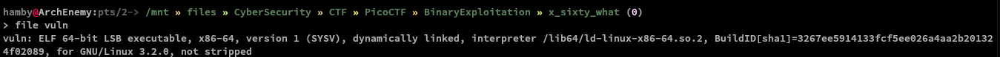

    Command: `checksec [filename]`

    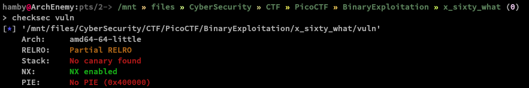

    We verified that the binary we our working on is a `64-bit` binary.

3. Let's view the source code that we also downloaded.

    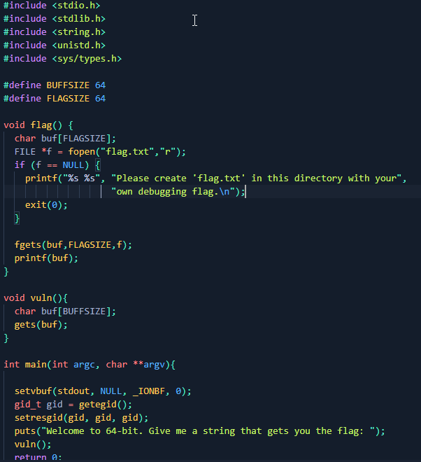

    From what we are seeing, this is similar to the previous challenges we solved so far. Let's try to test the binary just like we used to do in `32-bit` binaries.

4. Let's open up the binary in `gef` and try to play with the binary.

    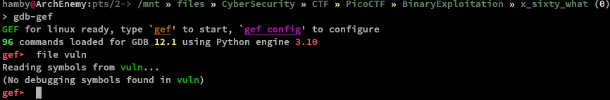

5. Create a cyclic pattern using `pattern create` and copy the output.

    Command: `pattern create`

    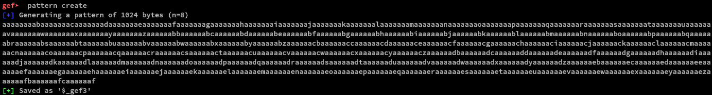

6. Run the binary by typing `r` and press enter then paste our pattern we just created.

    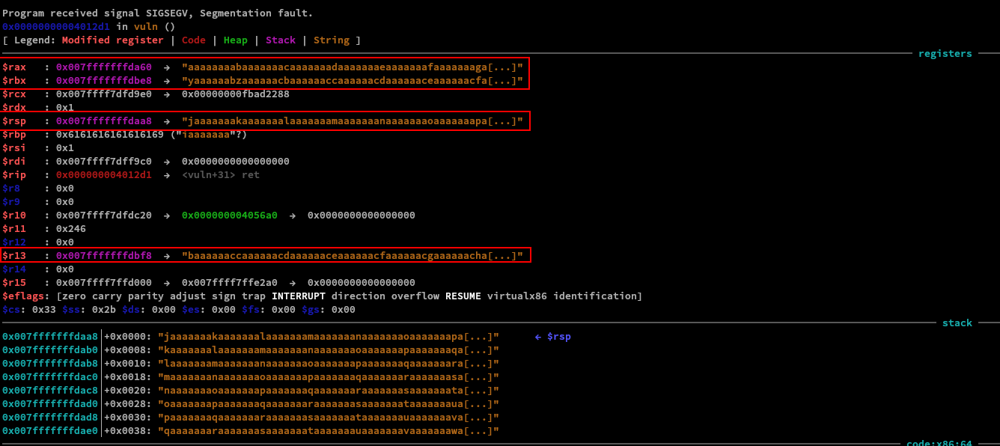

    Notice that even we overwritten different registers using our payload, we did not manage to overwrite the instruction pointer just like in the previous challenges.

    Reading the Intel x64 Manual, it says that:

    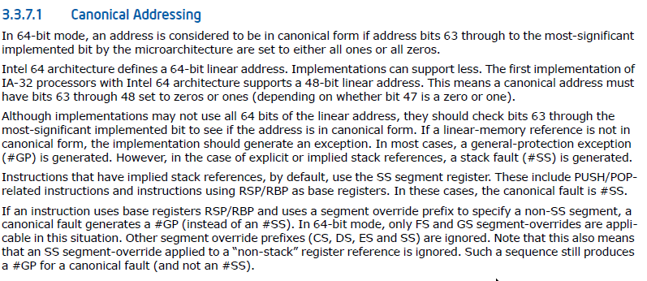

    Our pattern tried to overwrite the instruction pointer `rip` that does not follow the canonical addressing as prescribed in the Intel Assembly Manual.

    Let's now see which offset that we are starting to overwrite the instruction pointer.

7. Using `pattern search $rsp`, we can see that the offset is at `72`.

    

8. Let's take a look on `main()` func disassembly.

    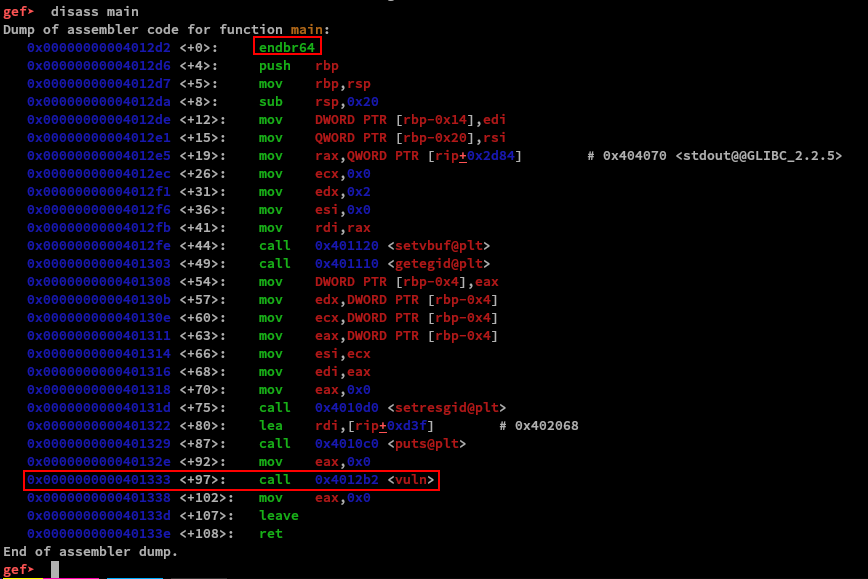

    Notice that `endbr64` instruction. That instruction will prevent us from jumping to the specific address of the `flag()` function. (*don't quote me on that*) Look at [this](https://stackoverflow.com/questions/56905811/what-does-the-endbr64-instruction-actually-do) link for more information.

9. Let's now create our payload. We can use `pwntools` for this.

    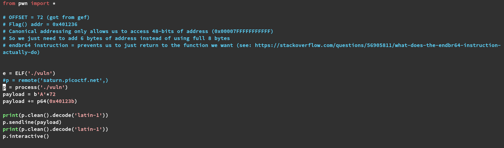

    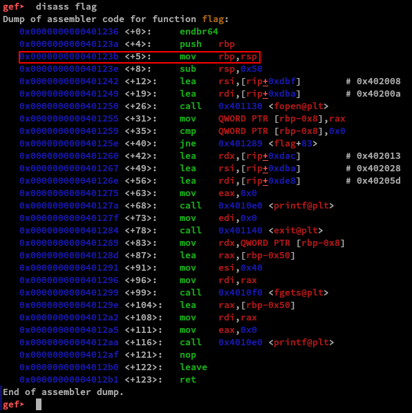

    Notice the address we put on our payload. Since we cannot jump directly on the address of `flag()` function, we put our address in `0x40123b` as shown in the disassembly image of `flag()` function.

10. We can now run our payload! Let's create a local `flag.txt` and see if our exploit will get us the flag.

    Local:

    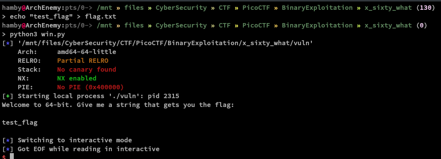

    Cool! We got the flag! How about the remote instance of the challenge to get the real flag? Don't forget to add the port on our script and comment out line 12!

    Remote:

    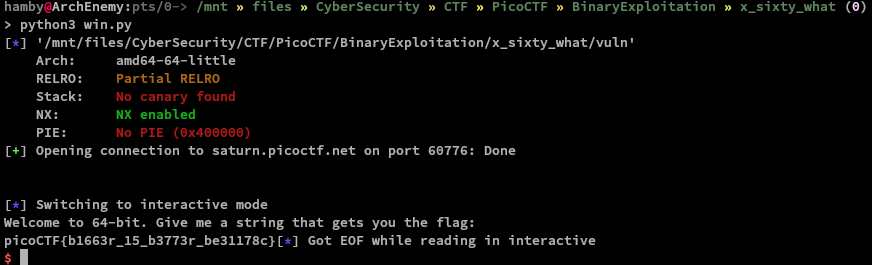

    Sweet! We completed the challenge!

11. Submit the flag and celebrate!

### Flag

Flag: `picoCTF{b1663r_15_b3773r_be31178c}`

### Additional Notes

I also added one-liner script for this challenge and if you are interested,

- See [this](https://raw.githubusercontent.com/hambyhacks/hambyhacks.github.io/main/Writeups/PicoCTF2022/Binary_Exploitation/x-sixty-what/img/python_oneliner.png) link for the image.
- see [this](https://raw.githubusercontent.com/hambyhacks/hambyhacks.github.io/main/Writeups/PicoCTF2022/Binary_Exploitation/x-sixty-what/img/bashfu.png) link for the image.
- see [this](https://raw.githubusercontent.com/hambyhacks/hambyhacks.github.io/main/Writeups/PicoCTF2022/Binary_Exploitation/x-sixty-what/img/bashfu2.png) link for the image.

#### Feedbacks

Note: *if there are any mistakes/errors in the explanation or anything in general feel free to dm me at Twitter: @hambyhaxx. I will correct and update the contents of this writeup. Thank you for reading!*
