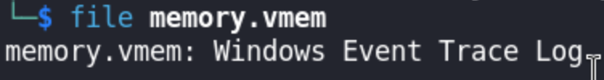

# RootCon 18 CTF Writeup

```bash
Name: Roll a 5d6
Category: BinForCry
Points: 150
Challenge Prompt: "Don't forget to roll initiative :wink:"
Solved By: Viettel Cyber Security, Tempura Tenders
```

## Introduction

We are given a file named `memory.rar`. Knowing the challenge category is `BinForCry`, we are safe to assume that the challenge is about **memory forensics**.

## Main()

Unarchive the file using the `unrar` and supply the given password (in this case **infected**).


We are greeted by 2 files named ``memory.vmem`` and ``memory.vmsn``. Using `file` command we got this output:



And upon Google search, we can see that the file is a virtual memory file.


In this case, we can use a tool named `volatility` (**we use volatility3 in this case.**) to examine memory and have a better understanding on the file we have gathered.

Knowing that the file is a Windows Event Trace Log, we can use the plugin: `windows.info.Info`.


My initial thought process for gathering information are:

1. Look for processes that are suspicious and worth noting.
2. Check for files created
3. Check for network status

To speed up the hunting for flag, we can use the plugin `windows.pslist.PsList` to scan for processes in the memory.


Upon listing the processes, we noticed that `Microsoft Edge` and `Notepad` are found in memory. We don't know much the `msedgewebvew.exe` so we initially skipped it.

Now that we have a process to inspect closely, lets dump the files created during the memory snapshot. Since we suspect `notepad.exe` is a suspicious process, we find instances in the files that contain `.txt` as file extension. We can use the plugin `windows.filescan.FileScan` for this.


Checking the number of instances, we only gathered 19 instances which is good for our searching process.


We found files named `downloads3.txt` and an interesting file named `secret.txt`. Judging from its file name, we can infer that this might be a hint to the flag. We can dump the file from memory using the plugin: `windows.dumpfiles.DumpFiles`.


The plugin needs a virtual address of the memory in which file to be dumped. We used `0xc00ed821fe70` as the value in `--virtaddr` flag which can be found in the file scan result we have done earlier.

Looking at the contents, we can see that this file might be the encoded flag.


The only caveat here that we do not have additional information on how do we decode this flag. :sobs: We only know that the format of the flag is `RC18{...}`. Shoutout to `FriedTempura` for confirming that the flag is `XOR` encoded.

To confirm that the flag is `XOR` encoded:


Looking back at the text in the file `secret.txt`, we noticed that it says that: `Don't forget the underscores!` indicating that the key should contain underscores.

We tried to bruteforce the key but to no avail. :sobs:

Upon skimming through the file scan results, we noticed that there is a file named `dice.jpg`. This rings a bell since the challenge name is `Roll a 5d6` which is a reference to a 5 six-sided dice.


We also dumped the file and we got our hint in decoding the flag.


We can see the image contents and we can see highlighted portions that contains 5 digit numbers ranging from 1-6. Shoutout to `engyn` for completing this solution! (*P.S we are stucked for a while here - half day-ish*)

Since the challenge name and prompt are talking about dice. We found this [repository](https://github.com/JohnHammond/ctf-katana) that gives us the final hint in completing the challenge.


We also noticed that there is one entry in the image that has incomplete highlight. We assumed that the last 2 values should be bruteforced (*spoiler: that is not the case*).

```bash
Numbers gathered: 66642 34355 25241 53534 62141 23233
```

Cross checking it on the [wordlist](https://www.eff.org/files/2016/07/18/eff_large_wordlist.txt) above, we can derive the words needed for the XOR encoded flag to be retrieved.

```bash
Retrieved Key: zero_identity_emptiness_september_thermal_diaper
```

We can use [this](https://www.dcode.fr/xor-cipher) site to decode the flag.


Yay! We got the flag! gg ez (*after ~12hrs-ish of randomly adding numbers XDDDD*)

```bash
Flag: RC18{may_you_always_roll_a_NAT20}
```


