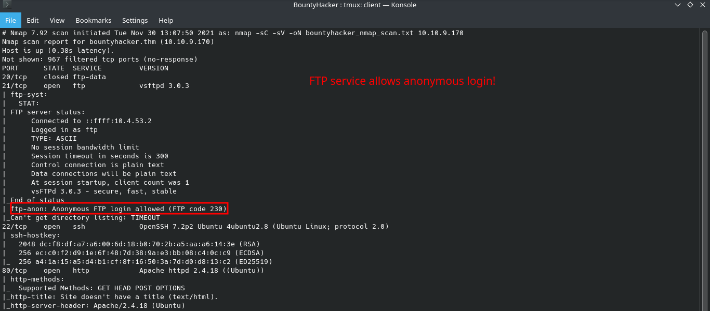
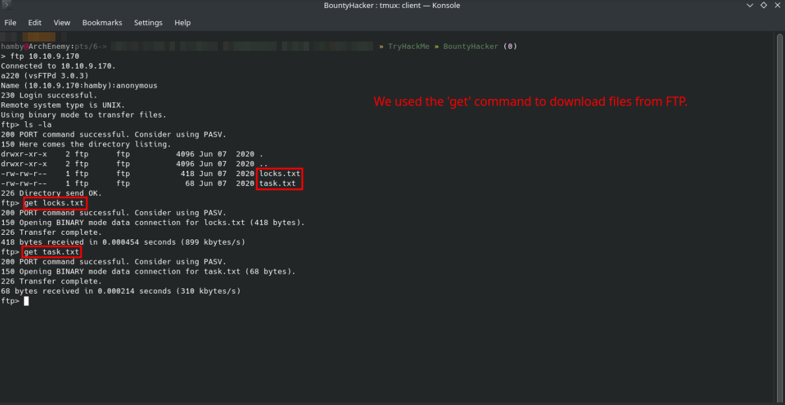
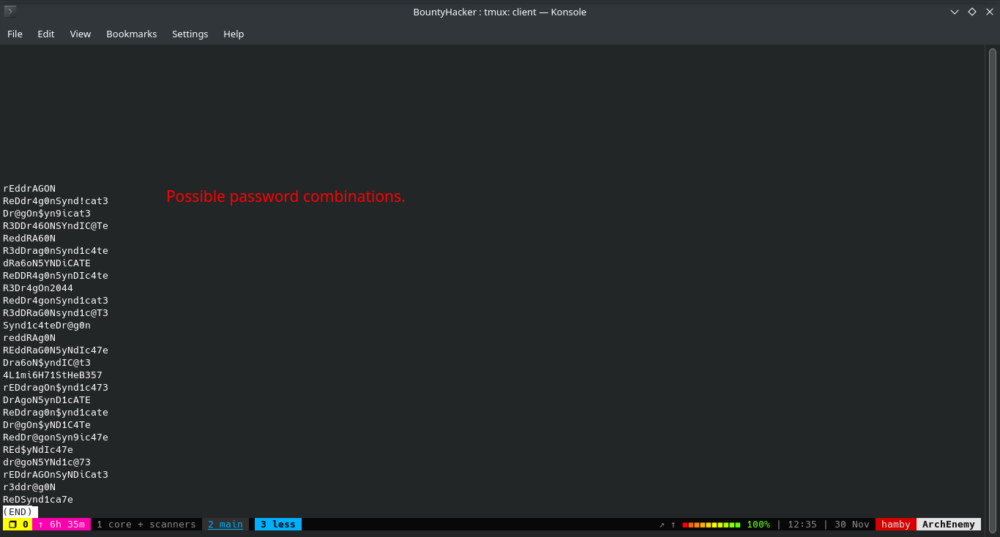
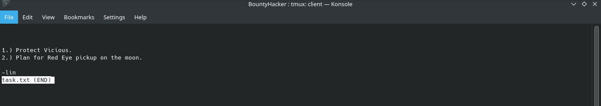
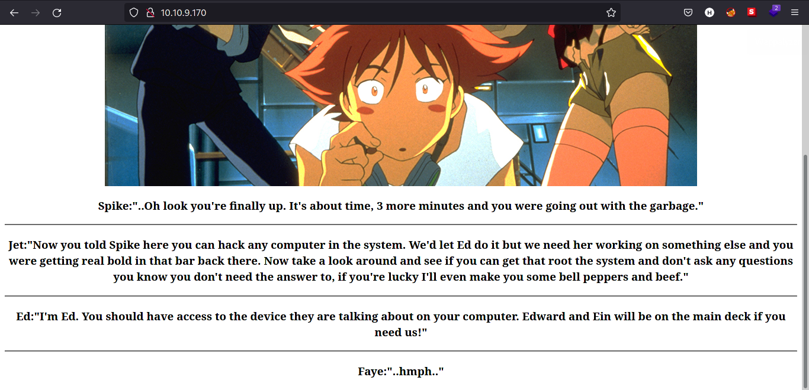
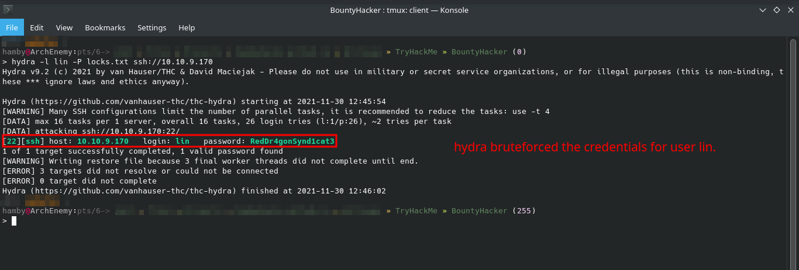
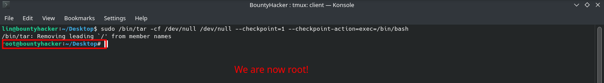
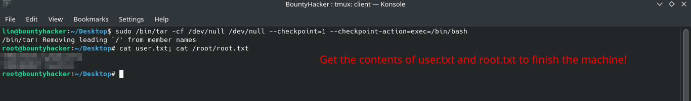

# [BountyHacker](https://tryhackme.com/room/cowboyhacker) by [Sevuhl](https://tryhackme.com/p/Sevuhl)

```bash
IP = 10.10.9.170*
Difficulty: Easy
Machine OS: Linux
Learning Platform: tryhackme.com
Finished on: Arch Linux
```

**Note: IP address may vary.*

## **Reconnaissance**

### *Scoping and Preparation*

Connect to OpenVPN Server using:

* ``sudo openvpn {PATH_TO_OVPN_FILE}``

I used my tool [CTFRecon](https://www.github.com/hambyhacks/CTFRecon) to automate directory creation, network scanning, web directory brute-forcing and adding entry to `/etc/hosts` file.

* To use [CTFRecon](https://www.github.com/hambyhacks/CTFRecon):

    ```bash
    1. git clone https://www.github.com/hambyhacks/CTFrecon
    2. cd CTFRecon
    3. chmod +x ctfrecon.sh && cp ctfrecon.sh ../ 
    #to move ctfrecon.sh to your working directory.
    1. sudo ./ctfrecon.sh [IP] [DIRECTORY NAME] [PLATFORM] [WORDLIST] 
    #platform refers to hackthebox(htb) or tryhackme(thm). Wordlist is used for GoBuster directory brute-forcing.
    ```

### *Preliminary Enumeration via nmap*

#### Table 1.1: nmap Results Summary

PORT | STATUS | SERVICE | VERSION
:---: | :---: | :---: | :---:
21/tcp | open | FTP | *vsftpd 3.0.3*
22/tcp | open | SSH | *OpenSSH 7.2p2 Ubuntu 4ubuntu2.8 (Ubuntu Linux; protocol 2.0)*
80/tcp | open | HTTP | *Apache httpd 2.4.18 ((Ubuntu))*

Based on `nmap` result below, we can see that the `FTP` port can be accessed anonymously



Machine OS: Based on OpenSSH version, machine is [Ubuntu Xenial](https://launchpad.net/ubuntu/+source/openssh/1:7.2p2-4ubuntu2.8).

## Enumeration

### *FTP Enumeration*

Let's look at the `FTP` service that is running and we can access anonymously. To login anonymously in `FTP` service:

* Type `anonymous` as the username and press enter as a password. It should log in as `anonymous` user.

Inside the `FTP` service, we found interesting files named `locks.txt` and `task.txt` that could also give us a possible username and passwords for the machine.

Lets try to download both of the `.txt` files and see the contents. To download the file, we can use the command `GET` to download the file we wanted.

* Syntax: `get {FILENAME}`



We can now exit the `FTP` prompt and check the contents of the file `locks.txt` and `task.txt`.

Checking the contents of `locks.txt` gives us a possible passwords that may be used for login.



`task.txt` contains a note created by `lin` that may be a user in the machine.



### *Web Enumeration*

Navigating to the webpage at port 80, gives us the webpage below.



We try to manually check for some directories such as `robots.txt` but it does not exist in the directory.

Also, using [GoBuster](https://github.com/OJ/gobuster) does not give us helpful results. Webpage may be a dead end for our enumeration.

Since we have possible usernames and passwords from our gathered information, we can try to use it in `SSH` service running on port `22`.

*Note: Manual Enumeration is important.*

## Exploitation

### *Steps to Reproduce*

1. Using [hydra](https://github.com/vanhauser-thc/thc-hydra), we tried to bruteforce credentials of `lin` user with the password list `locks.txt`.
   1. Syntax: `hydra -l {USERNAME} -P {PASSWORD_LIST} ssh://{IP}`

2. Wait for `hydra` to finish. Credentials will look like the image below.

    

3. Log in via `SSH` with newly found credentials.

#### Table 1.2: Credentials

Username | Password
:---: | :---:
lin | RedDr4gonSynd1cat3

## Privilege Escalation / Post-Exploitation

### *Internal Enumeration*

#### Table 1.3: Checklist for Linux Internal Enumeration

COMMAND | DESCRIPTION
:---: | :---:
``ss -tlnp``  | lists all sockets (``-t = tcp``) (``-l = listening``) (``-n = numeric``) (``-p = processes``)
``netstat -tulnp`` | &nbsp; |  &nbsp;
``sudo -l`` | lists all binaries/files/programs the current user has ``sudo`` permissions. (might require password)
``find / -type f -user root -perm -u+s 2>/dev/null`` | finds files in ``/`` directory that has [SUID](https://www.hackingarticles.in/linux-privilege-escalation-using-suid-binaries/) bit set. If any, consult [GTFOBins](https://gtfobins.github.io/).
``uname -a`` | prints system information (-a = all)
``whoami && id`` | prints `effective userid` (EUID) and prints `real` and `effective userid` and `groupids` (GID).

*Notes: For more information about the commands look [here](https://explainshell.com)*
*Tip: When nothing else makes sense, try to use [LinPEAS](https://github.com/carlospolop/PEASS-ng) ([winPEAS](https://github.com/carlospolop/PEASS-ng) for windows machines.).*

#### *Vertical Privilege Escalation*

Running our checklist, we found that using `sudo -l`, **`lin`** user can use `/bin/tar` as **`root`** user.


* To escalate our privileges, simply type in the terminal:
  * Syntax: `sudo /bin/tar -cf /dev/null /dev/null --checkpoint=1 --checkpoint-action=exec=/bin/bash`
* This should make us spawn a `root` shell

    

Reference for `tar` privilege escalation: <https://gtfobins.github.io/gtfobins/tar/>

We are now **root** user!

To finish the machine, get the contents of `user.txt` and `root.txt` and also the necessary answers for completion.



### STATUS: ROOTED

The next two steps are not necessary for completion of the machine but it completes the 5 Phases of Penetration Testing.

## Post Exploitation / Maintaining Access

Copied the /etc/shadow file for user identification and their passwords.

Added another root user for easy access.

## Clearing Tracks

Removed all logs and footprints to to prevent risk of exposure of breach to security administrator.

## Status: Finished

Feel free to reach out and if there is something wrong about the above post. Feedbacks are also appreciated :D

## Donation Box

### *Not required but appreciated :D*

[](https://ko-fi.com/hambyhaxx)

[](https://www.buymeacoffee.com/hambyhaxx)

### Socials

* [Twitter](https://twitter.com/hambyhaxx)

* [Medium](https://hambyhaxx.medium.com)

<-- [Go Back](https://hambyhacks.github.io)
