# [Colddbox: Easy](https://tryhackme.com/room/colddboxeasy) by [Coldd](https://tryhackme.com/p/Coldd)

```bash
IP = 10.10.70.248*
Difficulty: Easy
Machine OS: Linux
Learning Platform: tryhackme.com
```

**Note: IP address may vary.*

## **Reconnaissance**

### *Scoping and Preparation*

Connect to Tryhackme OpenVPN Server using:

* ``sudo openvpn {PATH_TO_OVPN_FILE}``

Run our recon tools such as `nmap` and `gobuster`.

I ran nmap twice to get the specific ports that are open so I can do OS and Version enumeration faster since I got the open ports needed.

1st Nmap command used: `sudo nmap -T4 -p- -oN [FILENAME] [IP]`

2nd Nmap command used: `sudo nmap -A -T4 -p[OPEN_PORTS_GOT_ON_1ST_NMAP_SCAN] -oN [FILENAME] [IP]`

Gobuster command used: `gobuster dir -u http://[IP] -w [WORDLIST] -o [FILENAME FOR OUTPUT] -t [NUMBER OF THREADS]`

## External Enumeration

### *Preliminary Enumeration via nmap*

#### Table 1.1: nmap Results Summary

PORT | STATUS | SERVICE | VERSION
:---: | :---: | :---: | :---:
80/tcp | open | HTTP | *Apache httpd 2.4.18 ((Ubuntu))*
4512/tcp | open | SSH | *OpenSSH 7.2p2 Ubuntu 4ubuntu2.10 (Ubuntu Linux; protocol 2.0)*

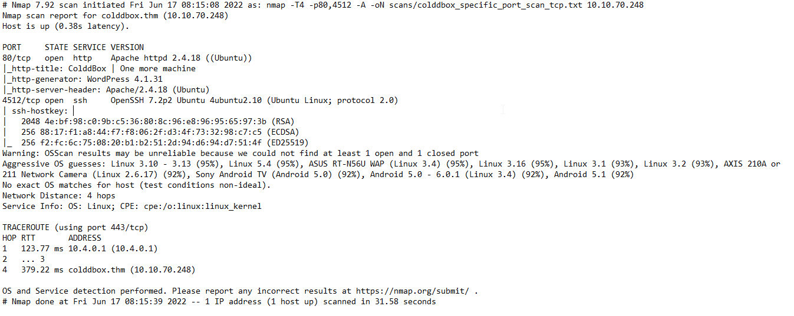

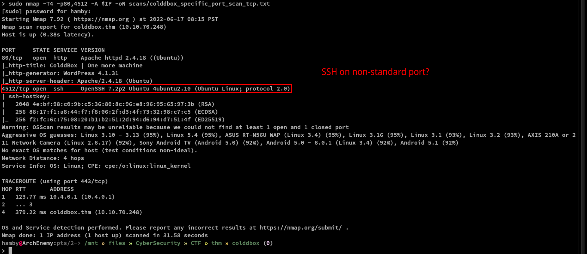

Nmap scan shows that SSH service is running on non-standard port (*4512 instead of 22*).

Ubuntu Version: [Ubuntu Xenial](https://launchpad.net/ubuntu/+source/openssh/1:7.2p2-4ubuntu2.10)

### Web Enumeration

Enumerating the web server only gives us a welcome message coming from the machine creator.

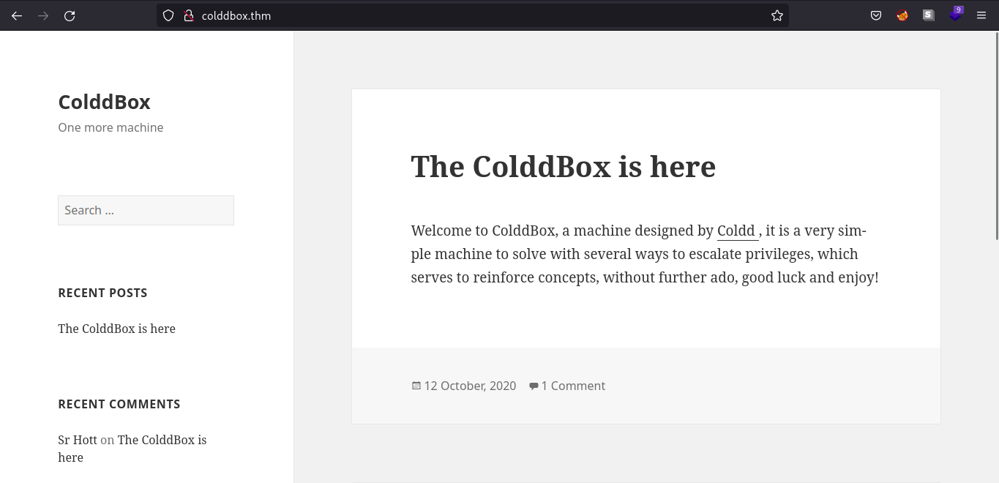

Let's see what the web technologies that the web server use. In this case, I use the browser extension `wapplayzer`. [Link](https://www.wappalyzer.com/apps/)

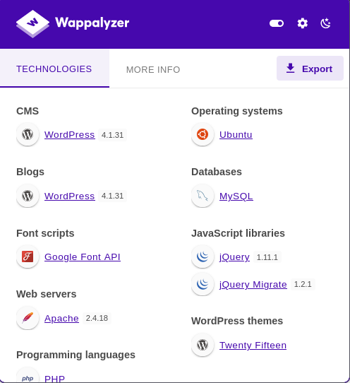

We can see that the web server is running WordPress (*v4.1.31*) and we can verify this by looking at `wp-login.php` page which is the login page for Wordpress.

### Content Discovery

## GoBuster Scan

Let's check if `gobuster` found some directories that we can work with.

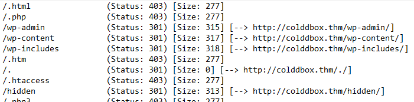

All of the results verifies that the web server is using WordPress.

## Exploitation

Let's try to use weak credentials in `wp-login.php`.

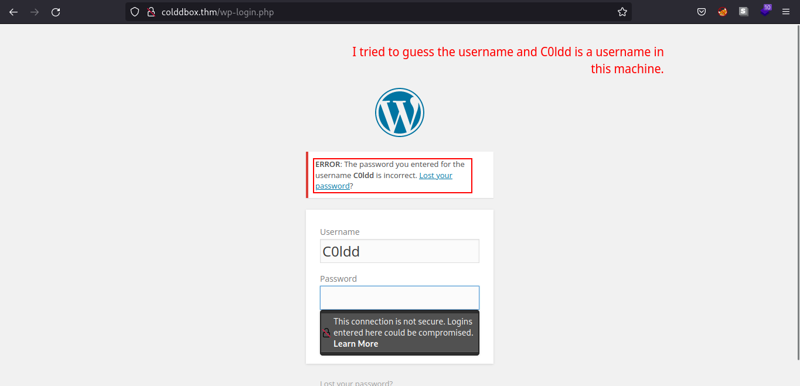

We have a verbose error message indicating `C0ldd` is a valid username in the machine.

### Using hydra

Since we know that `C0ldd` is valid username in the WordPress server, we can use `hydra` to bruteforce our way to the login page. (*spoiler: c0ldd's password is weak*)

Command used: `hydra -l C0ldd -P [Path_to_passwords] [IP_address] http-form-post '/wp-login.php:log^USER^&pwd=^PASS^&wp-submit=Log In&testcookie=1:S=Location'`

Command explanation: Used `hydra` to brute-force the login page using `http-form-post` module.

### Web Server Exploitation

After looking for some functionalties such as file upload and etc. We found out that we can edit `.php` files especially on themes used by WordPress page.

We editted the `404.php` page and pasted the PHP reverse shell from [PentestMonkey](https://github.com/pentestmonkey/php-reverse-shell). We can gain a shell login by adding a `netcat` listener on our attacking machine and navigating through
`[IP_ADDRESS]/wp-content/themes/twentyfifteen/404.php`.

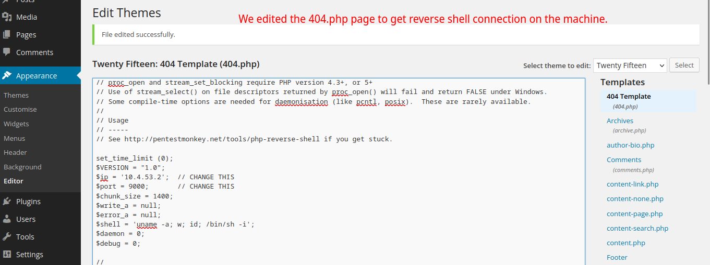

#### Failed Reverse Shell (needs netcat listener)

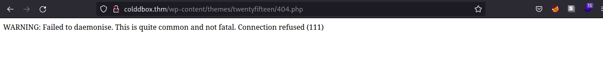

#### Successful Reverse Shell

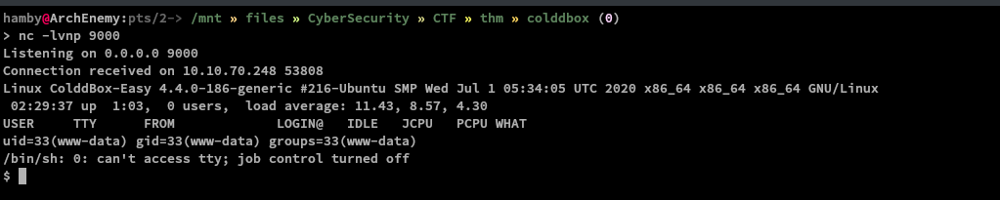

### Table 1.2: Credentials

Username | Password
:---: | :---:
c0ldd | 9876543210

## Post-Exploitation

### *Internal Enumeration*

#### Table 1.3: Checklist for Linux Internal Enumeration

COMMAND | DESCRIPTION
:---: | :---:
``ss -tlnp``  | lists all sockets (``-t = tcp``) (``-l = listening``) (``-n = numeric``) (``-p = processes``)
``netstat -tulnp`` | &nbsp; |  &nbsp;
``sudo -l`` | lists all binaries/files/programs the current user has ``sudo`` permissions. (might require password)
``find / -type f -user root -perm -u+s 2>/dev/null`` | finds files in ``/`` directory that has [SUID](https://www.hackingarticles.in/linux-privilege-escalation-using-suid-binaries/) bit set. If any, consult [GTFOBins](https://gtfobins.github.io/).
``uname -a`` | prints system information (-a = all)
``whoami && id`` | prints `effective userid` (EUID) and prints `real` and `effective userid` and `groupids` (GID).
``cat /etc/crontab`` | checks for cron jobs.

*Notes: For more information about the commands look [here](https://explainshell.com)*

*Tip: When nothing else makes sense, try to use [LinPEAS](https://github.com/carlospolop/PEASS-ng) ([winPEAS](https://github.com/carlospolop/PEASS-ng) for windows machines.).*

We are now logged in `www-data`.


We can try to spawn `tty` shell so we can easily navigate through terminal.

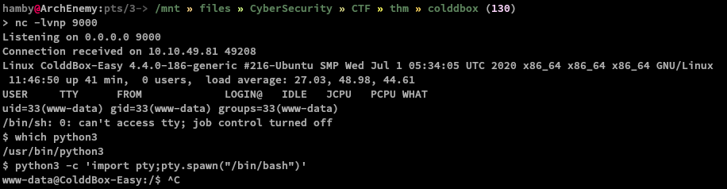

We can also spawn `tty` shell using this:

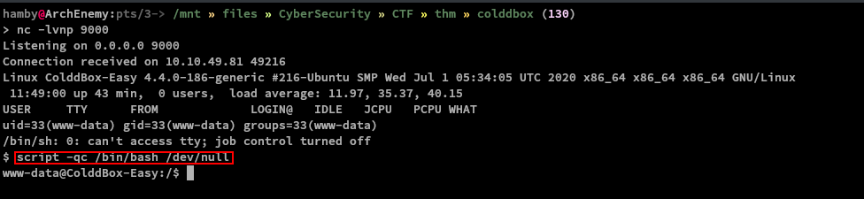

Let's run our mini checklist and let's look for SUID binaries!

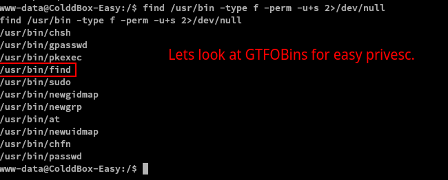

What a coincidence, we used `find` to find binaries with `SUID` bit set and `find` itself is a `SUID` binary! We can now escalate our privileges!

### *Privilege Escalation*

To escalate our privileges:

1. `cd /usr/bin`
2. `./find . -exec /bin/sh -p \;`
3. We are now root!

Note: Root shell is denoted by `#` (octothorpe/hashtag/number/pound) sign.

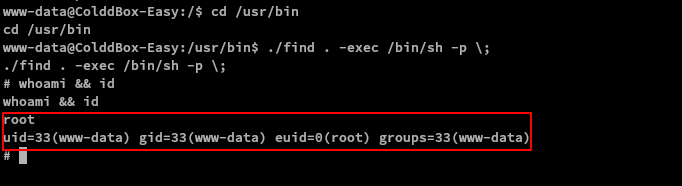

### Data Exfiltration

We also managed to get the confidential info for the machine and dumped it into a file named [Confidential.md](./confidential.md) (*includes user and root flag*)

### STATUS: ROOTED

The next two steps are not necessary for completion of the machine but it completes the 5 Phases of Penetration Testing.

## Persistence

Copied the /etc/shadow file for user identification and their passwords.

Added another root user for easy access.

## Clearing Tracks

Removed all logs and footprints to to prevent risk of exposure of breach to security administrator.

## Status: Finished

Feel free to reach out and if there is something wrong about the above post. Feedbacks are also appreciated! :D

## Donation Box

Not required but appreciated! :D

[](https://ko-fi.com/hambyhaxx)

[](https://www.buymeacoffee.com/hambyhaxx)

### Socials

* [Twitter](https://twitter.com/hambyhaxx)

* [Medium](https://hambyhaxx.medium.com)

<-- [Go Back](https://hambyhacks.github.io)
