# [Overpass 2 - Hacked](https://tryhackme.com/room/overpass2hacked) by [NinjaJc01](https://tryhackme.com/p/NinjaJc01)

```bash
IP = 10.10.223.88*
Difficulty: Easy
Machine OS: Linux
Learning Platform: tryhackme.com
Finished on: Arch Linux
```

**Note: IP address may vary.*

## Brief Description

This is the 2nd part of the Overpass series which includes packet analysis and source code analysis. Click [here](https://hambyhacks.github.io/Writeups/TryHackMe/Overpass/Overpass) if you wish to read the walkthrough for the first part of this series. I hope you enjoy this kind of writeups!

## **Reconnaissance**

### *Scoping and Preparation*

Connect to OpenVPN Server using:

* ``sudo openvpn {PATH_TO_OVPN_FILE}``

Download the file provided in Task 1.

In Task 3, let's start the machine to do some recon and enumeration while we analyze the `.pcap` file provided in Task 1.

I used my tool [CTFRecon-Go](https://www.github.com/hambyhacks/CTFRecon-Go) to automate directory creation, port scanning, web directory brute-forcing and adding entry to `/etc/hosts` file.

* To download [CTFRecon-Go] using `git clone` and running it:

```bash
    1. git clone https://github.com/hambyhacks/CTFRecon-Go && cd CTFRecon-Go
    2. go build . 
    3. sudo ./CTFRecon-Go -d [DIRECTORY_NAME] -p [PLATFORM] -i [IP] -w [WORDLIST_TO_USE_FOR_GOBUSTER] #Platform refers to tryhackme or hackthebox (thm, htb respectively.)
```

* You can also download the release binary by using `go install` : `go install github.com/hambyhacks/CTFRecon-Go@latest`

To use `CTFRecon-Go` if installed using `go install`:

* `sudo CTFRecon-Go -d [DIRECTORY_NAME] -p [PLATFORM] -i [IP] -w [WORDLIST_TO_USE_FOR_GOBUSTER]`

### PCAP Analysis

Let's look at the `.pcap` file provided in Task 1.

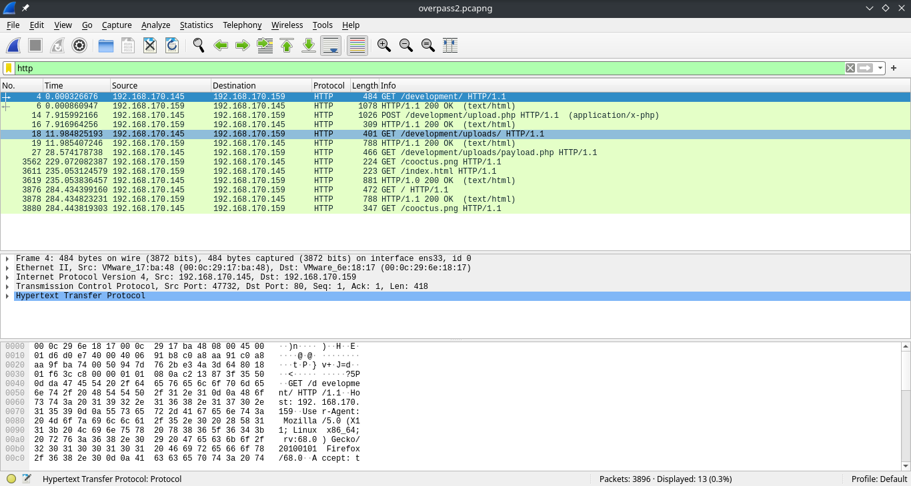

Opening up the file, we can see that there is a HTTP request on a page named `/development`.

Follow the TCP stream so we can clearly see where the HTTP request go. To follow TCP stream:

* `Right click on the packet then Click on Follow TCP stream.`

At TCP stream 1, there is a POST request on `/development/upload.php`, where the uploaded file is named as `payload.php` with a content that looks like a reverse shell!

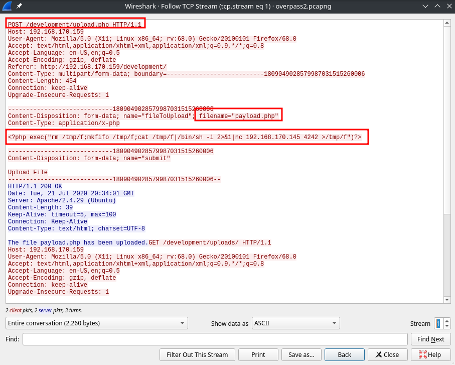

It seems the reverse shell payload was successfully uploaded.

Let's look further in the TCP streams.

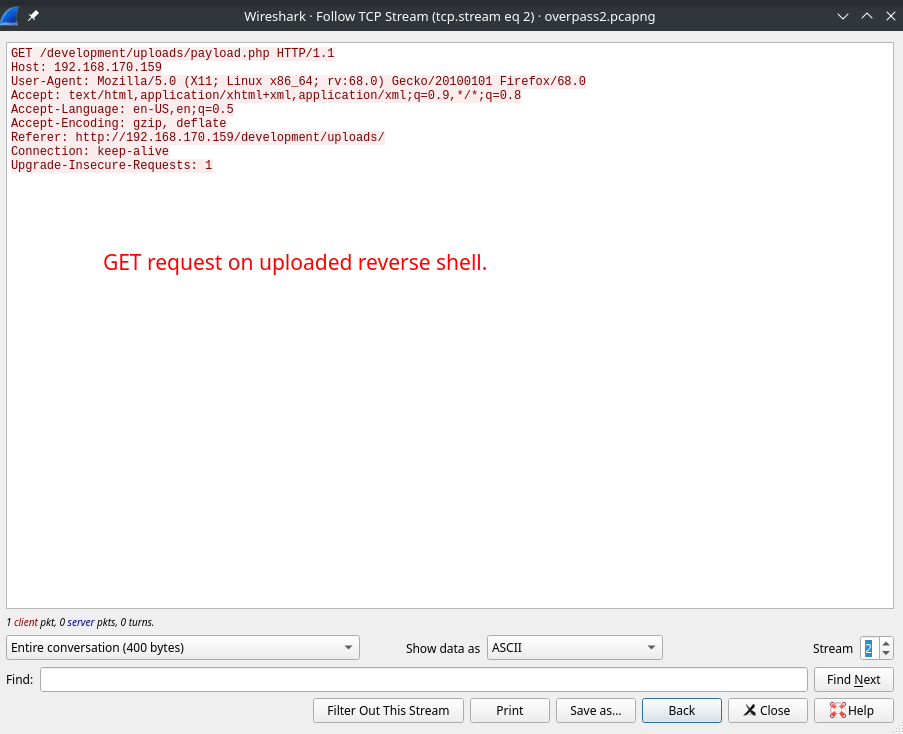

The attacker requests for his/her uploaded reverse shell to compromise the server.

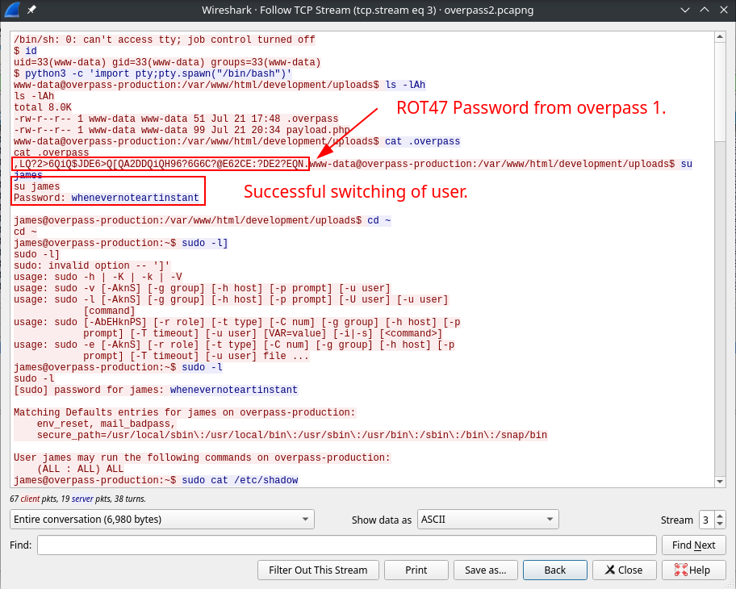

In the image above, we can see that the attacker successfully gained a shell access to the web server as `www-data`. The attacker immediately upgraded the shell and got the password from `.overpass` file which in `Overpass 1`, is a `ROT47` encrypted password.

The attacker also immediately switched user using `su` as `James` after decrypting the `.overpass` file.

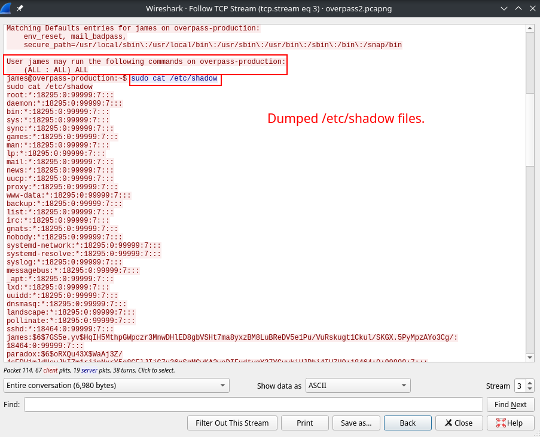

The image above shows that `james` has `sudo` privilege on the server which allows him to do **any** actions as the **root** user.

The attacker dumped the `/etc/shadow` file which contains the password for the users in the machine which is encrypted using `SHA-512` by looking at the start of the password string.

Example:

* `james:$6$...`

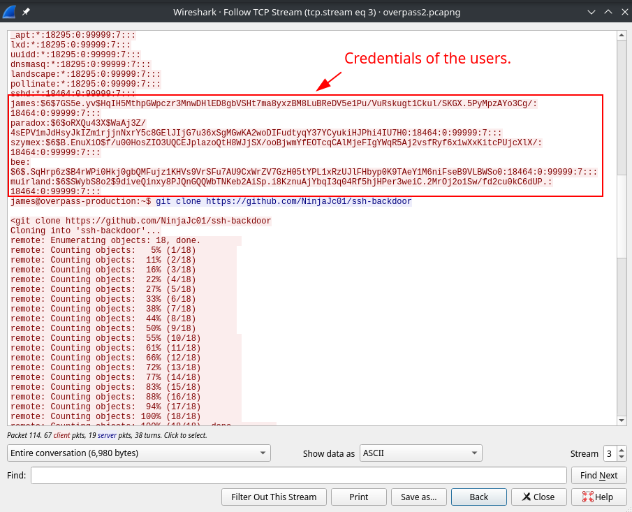

We can test the password strength of these credentials using any password cracking tool such as `hashcat` or `JohnTheRipper`.


The attacker downloaded a file named `ssh-backdoor` using `git`. Let's look the contents of that repository after we analyzed the `.pcap` file.

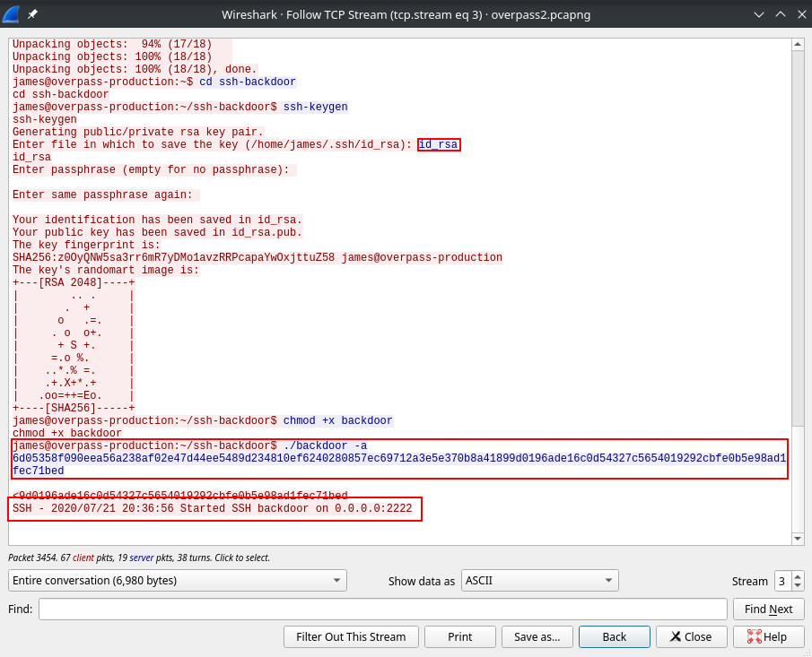

Using `ssh-keygen` the attacker created a private key `id_rsa` for easy backdoor access. The attacker also make the `backdoor` file executable and the `ssh-backdoor` is listening to port `2222`.

Looking on the command used by the attacker, `backdoor` is supplied with some type of hash.

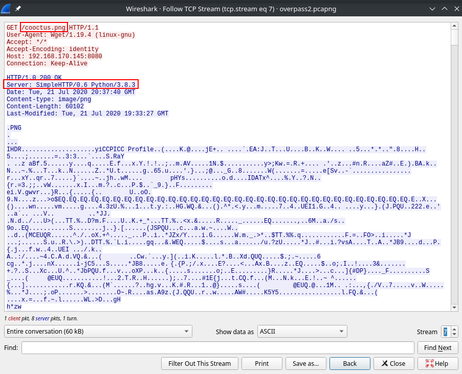

Fast forward to TCP stream 7, we can see from the image above that the attacker downloaded a file named `cooctus.png`.

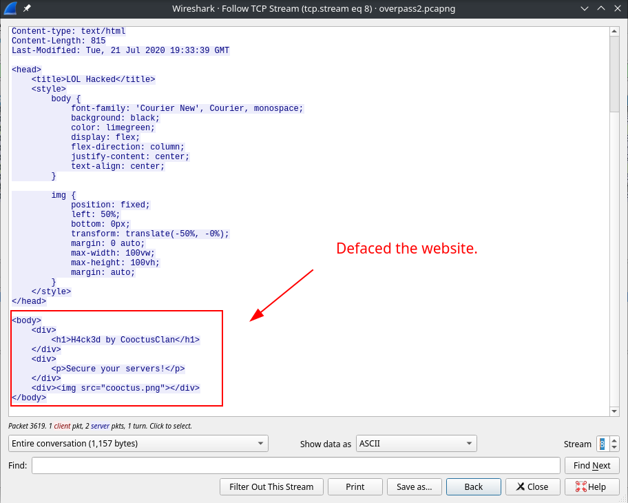

At TCP stream 8, the attacker decides to deface the website by using the `cooctus.png` file downloaded earlier.

Let's look at the contents of the `github repository` from which the `ssh-backdoor` was downloaded.

### Source Code Analysis

Navigate to the Github Repository by visiting the URL: <https://github.com/NinjaJc01/ssh-backdoor>

Let's look at the file `main.go`:

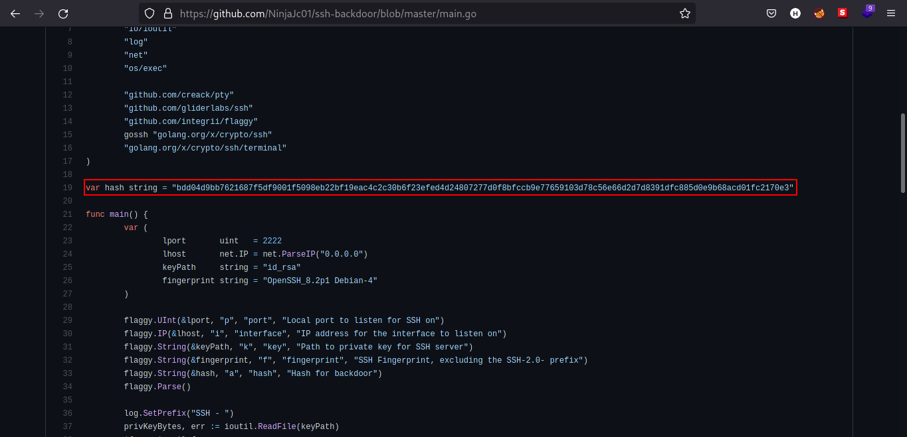

There is a hardcoded hash on the file. Let's take note of this for later.

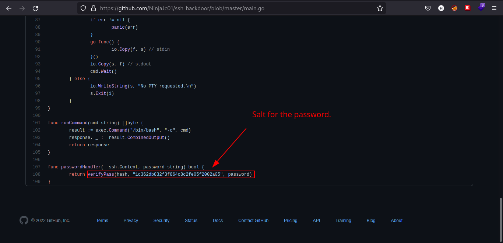

Also, there is a hardcoded salt which the function `verifyPass` needed as an argument.

Knowing we have the password hash and salt, we can now try to crack the password.

### Password Cracking

First, identify the type of hash used in the `ssh-backdoor`. We can use [Name That Hash](https://nth.skerritt.blog/) and paste the hash on the textbox. Since we have salt identified on the `.pcap` file. We should use `hashcat` mode `1710`.

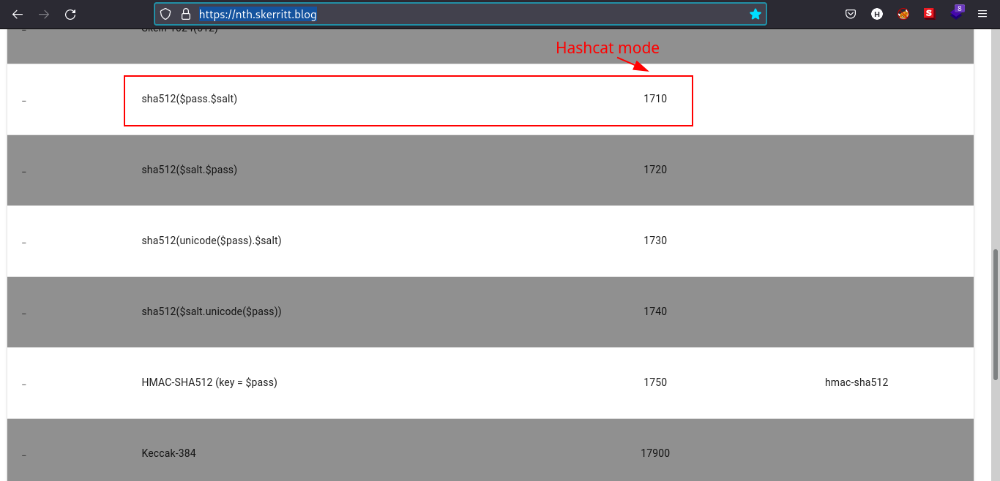

Using [Colabcat](https://colab.research.google.com/github/someshkar/colabcat/blob/master/colabcat.ipynb), I managed to crack the hash with salt given on the `.pcap` file and `main.go`. I used `Colabcat` because I don't have `hashcat` and `John` configured properly.

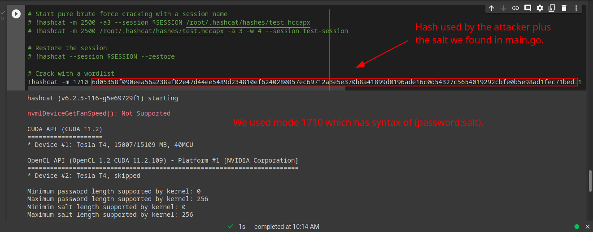

### Credentials

User | Password
:---: | :---:
james | november16

We can now look at the result of our Nmap and Gobuster scan earlier from `CTFRecon-Go`.

## External Enumeration

### *Preliminary Enumeration via nmap*

#### Table 1.1: nmap Results Summary

PORT | STATUS | SERVICE | VERSION
:---: | :---: | :---: | :---:
22/tcp | open | SSH | *OpenSSH 7.6p1 Ubuntu 4ubuntu0.3 (Ubuntu Linux; protocol 2.0)*
80/tcp | open | HTTP | *Apache httpd 2.4.29 ((Ubuntu))*
2222/tcp | open | SSH | *OpenSSH 8.2p1 Debian 4 (protocol 2.0)*

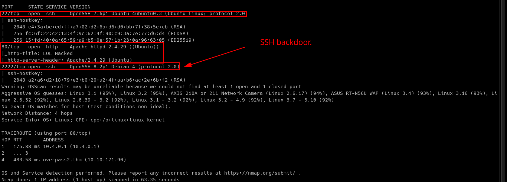

Machine OS: Based on OpenSSH version on port 22, machine is [Ubuntu Bionic](https://launchpad.net/ubuntu/+source/openssh/1:7.6p1-4ubuntu0.3).

Let's look at the `HTTP` server on port 80.

### Web Enumeration

We can see that the web page has been defaced by Cooctus Clan.

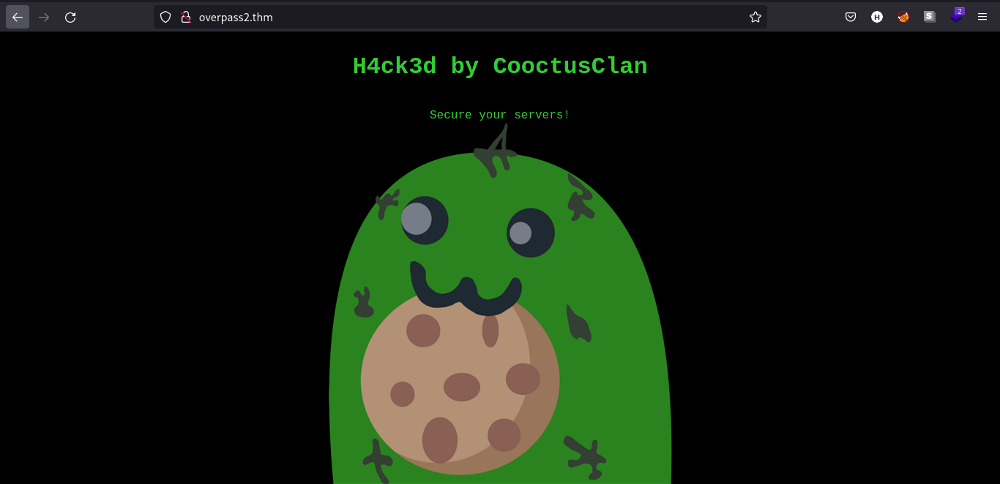

Knowing the credentials for `james`, we can now try to hack our way back in!

## Exploitation

We have the credentials for `james` in `SSH-backdoor`, we can try to login via ssh.

To login via `ssh`:

* `ssh james@[IP] -p 2222`
* With password: `november16` *see credentials table above.*

We logged in via port 2222 because it is where the `ssh-backdoor` serves `SSH` service.

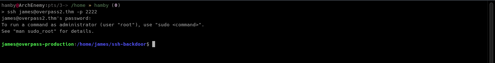

Let's enumerate further more.

## Post-Exploitation

### *Internal Enumeration*

#### Table 1.3: Checklist for Linux Internal Enumeration

COMMAND | DESCRIPTION
:---: | :---:
``ss -tlnp``  | lists all sockets (``-t = tcp``) (``-l = listening``) (``-n = numeric``) (``-p = processes``)
``netstat -tulnp`` | &nbsp; |  &nbsp;
``sudo -l`` | lists all binaries/files/programs the current user has ``sudo`` permissions. (might require password)
``find / -type f -user root -perm -u+s 2>/dev/null`` | finds files in ``/`` directory that has [SUID](https://www.hackingarticles.in/linux-privilege-escalation-using-suid-binaries/) bit set. If any, consult [GTFOBins](https://gtfobins.github.io/).
``uname -a`` | prints system information (-a = all)
``whoami && id`` | prints `effective userid` (EUID) and prints `real` and `effective userid` and `groupids` (GID).
``cat /etc/crontab`` | checks for cron jobs.

*Notes: For more information about the commands look [here](https://explainshell.com)*

*Tip: When nothing else makes sense, try to use [LinPEAS](https://github.com/carlospolop/PEASS-ng) ([winPEAS](https://github.com/carlospolop/PEASS-ng) for windows machines.).*

Let's navigate to the home directory of `james` and see its contents.

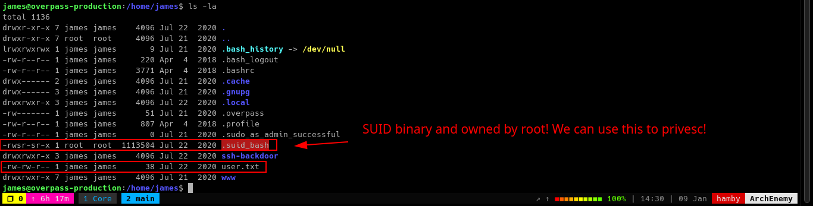

`.suid_bash`  and user.txt are the files which are interesting to see.

Running `.suid_bash` gives us a shell but notice the permissions on that file. It is owned by **root** and having `SUID` permissions on it which means we can run it as **root** without escalating privileges. Taking the explanation from <https://www.redhat.com/sysadmin/suid-sgid-sticky-bit>: `"A file with SUID always executes as the user who owns the file, regardless of the user passing the command."`

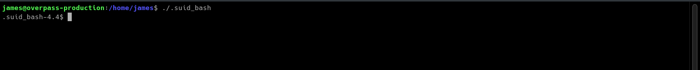

We can try to escalate our privileges knowing that `.suid_bash` has `SUID` bit set on its permissions.

### *Privilege Escalation*

Looking at the flags for `bash`, we can use `-p` flag for the `.suid_bash` run as **root**.

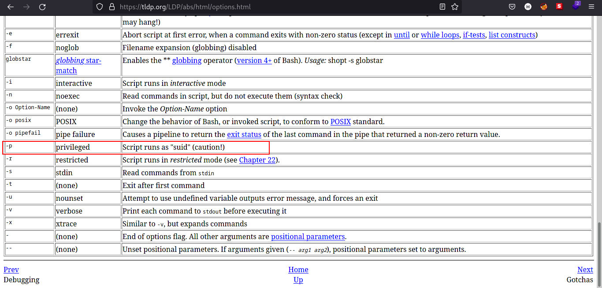

Also from [GTFOBins](https://gtfobins.github.io/gtfobins/bash/), we can see that `-p` flag is used in privilege escalation.


Let's try to use it in `.suid_bash`:

Now we are root!

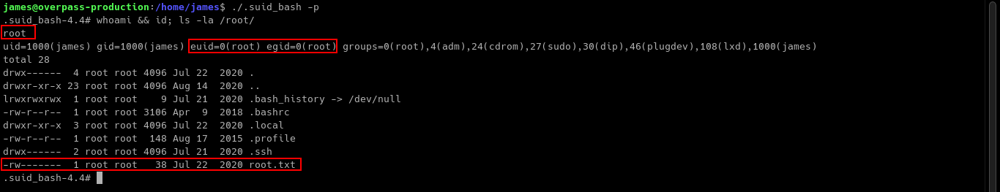

### STATUS: ROOTED

The next two steps are not necessary for completion of the machine but it completes the 5 Phases of Penetration Testing.

## Persistence

Copied the /etc/shadow file for user identification and their passwords.

Added another root user for easy access.

## Clearing Tracks

Removed all logs and footprints to to prevent risk of exposure of breach to security administrator.

## Status: Finished

Feel free to reach out and if there is something wrong about the above post. Feedbacks are also appreciated! :D

## Donation Box

### *Not required but appreciated! :D*

[](https://ko-fi.com/hambyhaxx)

[](https://www.buymeacoffee.com/hambyhaxx)

### Socials

* [Twitter](https://twitter.com/hambyhaxx)

* [Medium](https://hambyhaxx.medium.com)

<-- [Go Back](https://hambyhacks.github.io)
