# [UltraTech](https://tryhackme.com/room/ultratech1) by [lp1](https://tryhackme.com/p/lp1)

```bash
IP = 10.10.186.15*
Difficulty: Medium
Machine OS: Linux
Learning Platform: tryhackme.com
Finished on: Arch Linux
```

**Note: IP address may vary.*

## **Reconnaissance**

### *Scoping and Preparation*

* Connect to OpenVPN Server using:

    ``sudo openvpn {PATH_TO_OVPN_FILE}``

* I used my tool [CTFRecon](https://www.github.com/hambyhacks/CTFRecon) to automate directory creation, network scanning, web directory brute-forcing and adding entry to `/etc/hosts` file.

* To use [CTFRecon](https://www.github.com/hambyhacks/CTFRecon):

    ```bash
    1. git clone https://www.github.com/hambyhacks/CTFrecon
    2. cd CTFRecon
    3. chmod +x ctfrecon.sh && cp ctfrecon.sh ../ 
    #to move ctfrecon.sh to your working directory.
    4. sudo ./ctfrecon.sh [IP] [DIRECTORY NAME] [PLATFORM] [WORDLIST] 
    #platform refers to hackthebox(htb) or tryhackme(thm). Wordlist is used for GoBuster directory brute-forcing.
    ```

### *Preliminary Enumeration via nmap*

#### Table 1.1: nmap Results Summary

PORT | STATUS | SERVICE | VERSION
:---: | :---: | :---: | :---:
21/tcp | open | FTP | *vsftpd 3.0.3*
22/tcp | open | SSH | *OpenSSH 7.6p1 Ubuntu 4ubuntu0.3 (Ubuntu Linux; protocol 2.0)*
8081/tcp | open | HTTP | *Node.js Express framework*
31331/tcp | open | HTTP | *Apache httpd 2.4.29 ((Ubuntu))*

* Based on `nmap` result, we can see that there are web servers on non-standard HTTP/s port (`80` & `443`). In this case the web servers are on ports `8081` and `31331`.

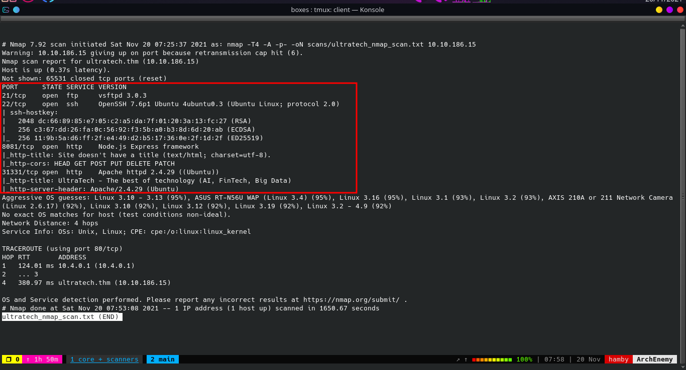

Machine OS: Based on OpenSSH version, machine is [Ubuntu Bionic](https://launchpad.net/ubuntu/+source/openssh/1:7.6p1-4ubuntu0.3).

## Enumeration

### FTP Enumeration

* Looking at our `nmap` result, we cannot do anything much about here at `FTP` service since it does not allow anonymous login. We also searched [exploit-db](https://exploit-db.com) to look for version exploits but it is not helpful for us because it is a Remote Denial-of-Service exploit.

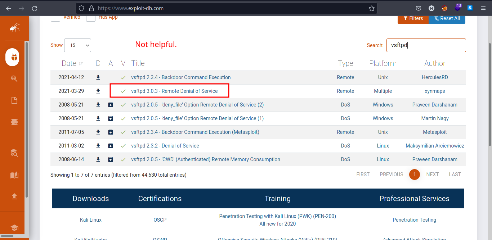

### *Manual Web Enumeration*

* Since we don't have webpage at port 80, we navigate to port 8081 which is a web server.

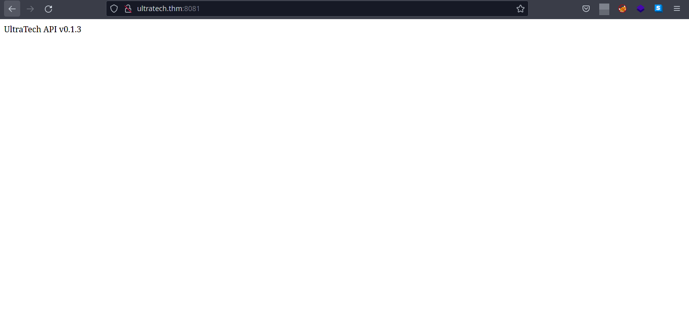

* Based on our nmap scan port `8081` is a `Node.js` framework.

* Let's now look on ther service on port `31331` which is an `apache` web server.


* Looking at the functionality of the webpage, we found another endpoint called `/what.html`.

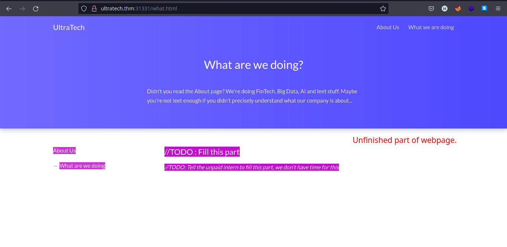

* This shows some developer's comments on a production webpage.

* Let's enumerate more using automated tools.

*Note: Manual Enumeration is important.*

### *Web Enumeration using GoBuster*

* Using [GoBuster](https://github.com/OJ/gobuster), we found some interesting directories.

* Let's look at the result of ``GoBuster`` scan on port `8081`.

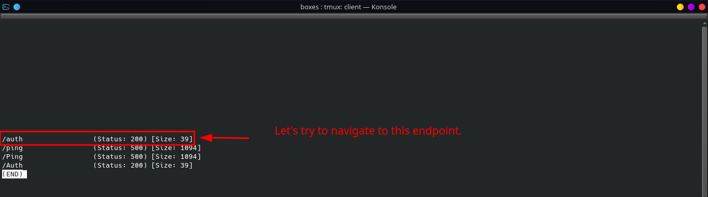

* `/auth` endpoint requires out login info and we don't have any so we enumerate more.

* We can also look on ``GoBuster`` scan results on port `31331`.

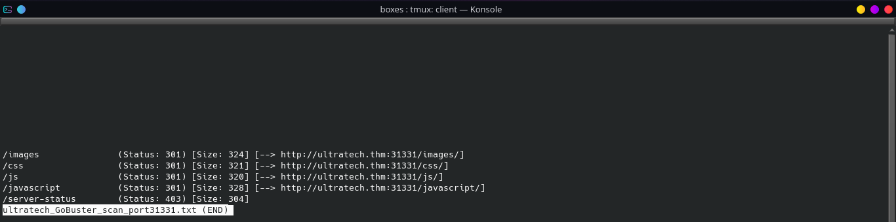

* Let's look at the `/js` directory to see if there is an interesting `.js` files in it.

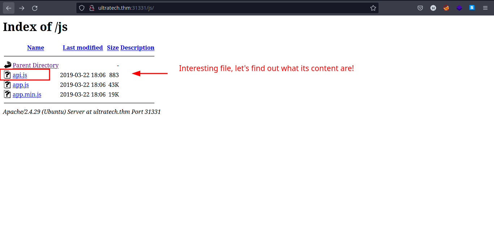

* Nice! We found some `.js` files. But `api.js` looks more interesting than the other two. Let's peek at the contents of `api.js`.

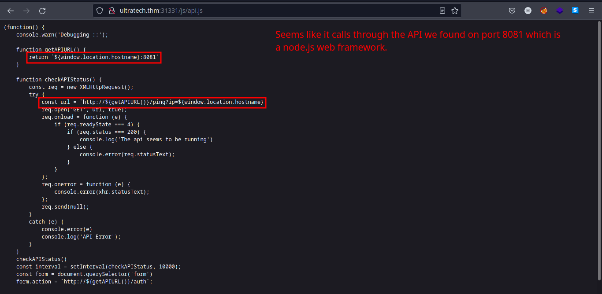

  * * Looks like the ``ultratech.thm:8081`` is executing `ping` command with user input on the backend. Let's try to tinker with it later.

*Tip: When in doubt, search it in Google.*

## Exploitation

*Steps to reproduce:*

1. Navigate to ``ultratech:8081/ping`` and add the parameter `ip` as seen in the `api.js` file.

2. Input the payload: `?ip=localhost`

    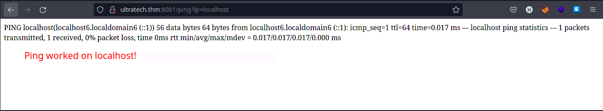

3. Command injection works and should output a `ping` request to `localhost`.

4. Input the payload: ``?ip=localhost `ls` ``

    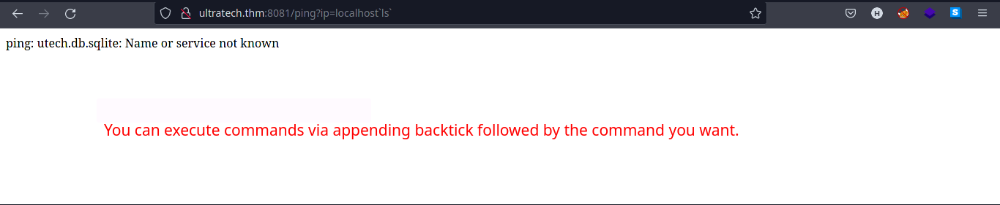

5. It should list the files/directories in the current user.

6. Input the payload: ``?ip=localhost `cat utech.db.sqlite` ``. It should output the content of ``utech.db.sqlite`` file containing user hashes.

    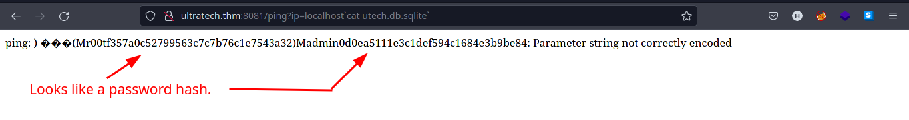

7. Go to [CrackStation](https://crackstation.net) to see if the hashes are cracked.

8. Input the hashes you found on `utech.db.sqlite` file to the input box in [CrackStation](https://crackstation.net).

    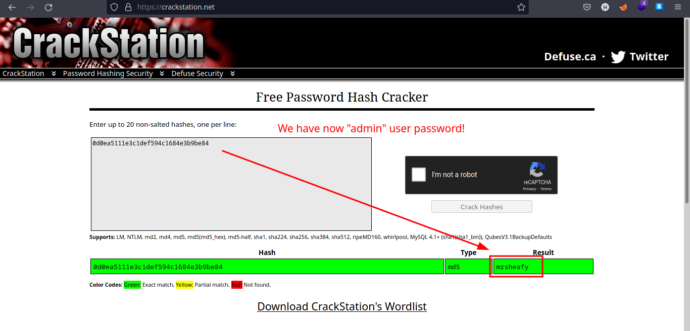

    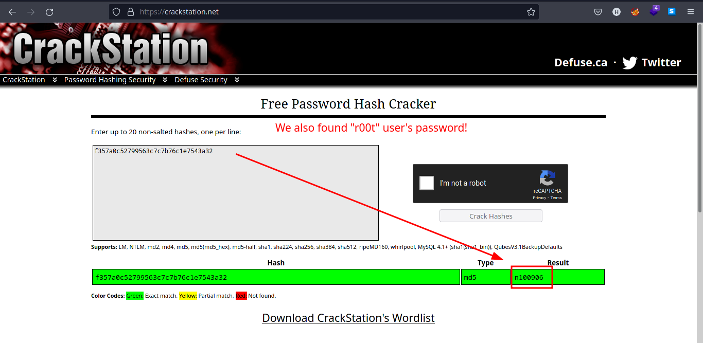

9. Save the credentials in a file.

10. Try logging in the credentials in either `SSH` or `FTP`. In this case, `SSH` is used to login.

    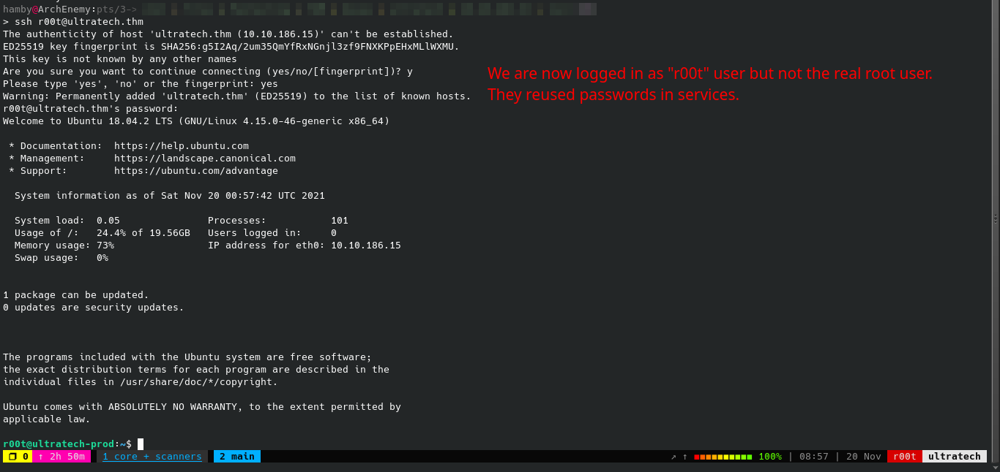

## Privilege Escalation / Post-Exploitation

### *Internal Enumeration*

#### Table 1.2: Checklist for Linux Internal Enumeration

COMMAND | DESCRIPTION
:---: | :---:
``ss -tlnp``  | lists all sockets (``-t = tcp``) (``-l = listening``) (``-n = numeric``) (``-p = processes``)
``netstat -tulnp`` | &nbsp; |  &nbsp;
``sudo -l`` | lists all binaries/files/programs the current user has ``sudo`` permissions. (might require password)
``find / -type f -user root -perm -u+s 2>/dev/null`` | finds files in ``/`` directory that has [SUID](https://www.hackingarticles.in/linux-privilege-escalation-using-suid-binaries/) bit set. If any, consult [GTFOBins](https://gtfobins.github.io/).
``uname -a`` | prints system information (-a = all)
``whoami && id`` | prints `effective userid` (EUID) and prints `real` and `effective userid` and `groupids` (GID).

*Notes: For more information about the commands look [here](https://explainshell.com)*
*Tip: When nothing else makes sense, try to use [LinPEAS](https://github.com/carlospolop/PEASS-ng) ([winPEAS](https://github.com/carlospolop/PEASS-ng) for windows machines.).*

* Running our checklist, we found that using ``whoami && id`` we are in a `docker` group.

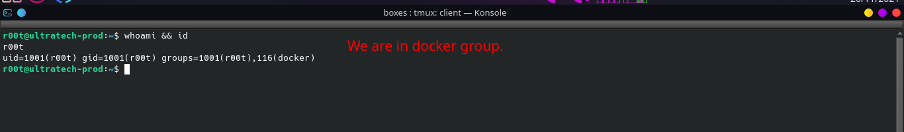

* If a user in a machine is in the `docker` group, it also grants privileges equivalent to `root` user. Check this [article](https://docs.docker.com/engine/install/linux-postinstall/) explaining the inner workings of `Docker daemon`.

* To verify that `docker` is running as root we can type in the terminal:

    Syntax: ``ps -aux | grep docker``

    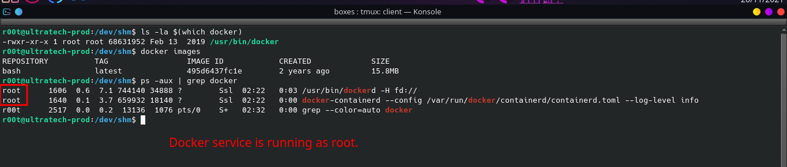

### *Vertical Privilege Escalation*

* We can use [GTFOBins](https://gtfobins.github.io) to check if we can exploit it to escalate our privileges. To exploit ``docker``:

    1. We need to know if there is an image installed in `docker`.To list images in `docker`:
        * ``docker ps -a``
    2. To escalate our privileges, type in the terminal:

        * ``docker run -v /:/mnt --rm -it {IMAGE_NAME} chroot /mnt sh``

        

* Navigate to /root/ and copy the first 9 characters of `.ssh/id_rsa/` of root user.

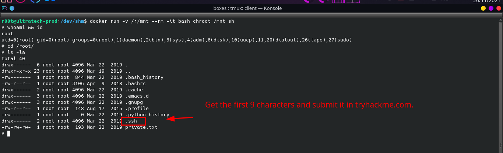

### STATUS: ROOTED

The next two steps are not necessary for completion of the machine but it completes the 5 Phases of Penetration Testing.

## Post Exploitation / Maintaining Access

* Copied the /etc/shadow file for user identification and their passwords.

* Added another root user for easy access.

## Clearing Tracks

* Removed all logs and footprints to to prevent risk of exposure of breach to security administrator.

## Status: Finished

Feel free to reach out and if there is something wrong about the above post. Feedbacks are also appreciated :D

## Donation Box

### *Not required but appreciated :D*

[](https://ko-fi.com/hambyhaxx)

[](https://www.buymeacoffee.com/hambyhaxx)

### Socials

* [Twitter](https://twitter.com/hambyhaxx)

<-- [Go Back](https://hambyhacks.github.io)